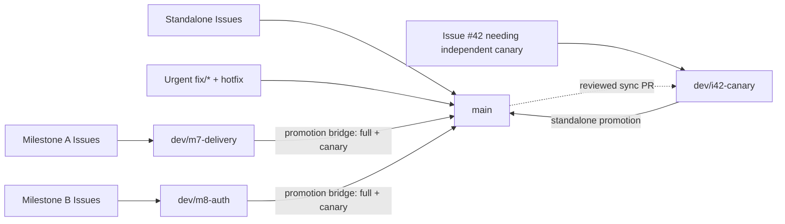

# CSARC Repo Template

[繁體中文](README.md)

Cyber-Arch's updatable repository foundation: creating a new project, adopting an existing one, and receiving policy updates all preview and verify before a PR merges them. Use the common workflow alone, or opt into Python, Rust, and TypeScript independently.

| Item | Current status |
| --- | --- |
| Template version | v0.25.1<!-- x-release-please-version --> |
| Supported languages | Python, Rust, TypeScript (independently multi-selectable; choosing none uses only the common workflow) |
| repo-site presentation template version | 1.1.0 |
| repo-site render engine version | 1.1.0 |

> [!IMPORTANT]
> Milestone 13 is expanding the repo site and the adoption experience. Only reviewed workflows under `.github/workflows/` currently execute; the rest stay archived. See [CI/CD settings](docs/index.html#testing) for each stage's enabled status.

| Choose directly | Formally available today |
| --- | --- |
| Language | Python, Rust, TypeScript are independently multi-selectable; choosing none uses only the common workflow |
| Branching | Each delivery batch gets its own development branch, changes merge straight to `main`, or work first collects on `dev` |
| Template configuration | Choices made at create/adopt time are written to `.csarc/config.yml`; later template updates read the same file instead of duplicating settings elsewhere |
| Shared capabilities | Issue and pull request forms, AI working rules, automated verification, dependency security, version records, and template updates |

README is the compact entry point to the [repo-site](docs/index.html). They keep public facts aligned without requiring identical text or structure. This repository and its [GitHub Pages repo-site](docs/index.html) are currently publicly readable. `noindex`/`robots.txt` can only reduce search indexing; they cannot restrict reading or sharing. See [Issue #79](https://github.com/Innoguard-Cyber-Arch/csarc-repo-template/issues/79) for the interim record and [Issue #425](https://github.com/Innoguard-Cyber-Arch/csarc-repo-template/issues/425) for the pending hosting/access-control decision.

> **What this document is for:** README tells a general adopter of this template what this is, whether to use it, how to start, and where to learn more. To contribute to this repository itself, read [`AGENTS.md`](AGENTS.md) (the executable working rules). For the "why" behind these choices, read the [repo-site appendix](docs/index.html). Each document owns one layer, so the same rules are not maintained twice.

## Table of contents

- [Overview](#overview)
- [Quick start](#quick-start)
- [Prerequisites](#prerequisites)
- [Technology and layout](#technology-and-layout)
- [Development and verification](#development-and-verification)
- [Configuration and secrets](#configuration-and-secrets)
- [Release and operations](#release-and-operations)
- [Template updates](#template-updates)
- [Owners and support](#owners-and-support)
- [License](#license)

## Overview

This repo maintains a Copier template, shared CI, security checks, and GitHub configuration drafts. `template/` is what gets shipped downstream; the root of this repository uses the same rules on itself.

Available today: a common CI/CD baseline plus independently selectable Python, Rust, and TypeScript language modules, along with Issue/spec, PR checks, and verification. `documentation_mode` selects the full template plus content, content management only, or no documentation management. `primary_language` and `i18n` select the English/Traditional Chinese entry points, while `features` is reserved for non-documentation capabilities such as Docker. Same-PR version materialization, GitHub Releases, packaging, checksums, and SBOMs remain candidates until proven by a default-branch live run. Registry publishing and general deployment remain disabled. The settings script reports the account plan separately from live API capability.

## Quick start

Git, GitHub CLI 2.93.0 or newer, and uv are common requirements; choosing Rust also needs rustup, and choosing TypeScript also needs Node 24+ and pnpm 11. Selecting none of the three language modules (`language: ci`) needs no extra language toolchain. CSARC delivers a CI/CD template and governance workflow; Python only runs the thin init/adopt/update CLI. `uvx --python 3.14` acquires an isolated runtime per invocation, so nothing needs a pre-installed or globally maintained Python. Run this from WSL2 on Windows. See [Prerequisites](#prerequisites) below for the itemized macOS/Windows install commands and the full tool list for both the "adopting a project" and "template contributor" situations.

`scripts/resolve-cache-root` already points at a user-level cache location shared across worktrees by default (`~/Library/Caches/csarc` on macOS; on Linux/WSL2 it follows the XDG Base Directory convention, preferring `$XDG_CACHE_HOME` and falling back to `~/.cache/csarc`), so `uv`, `pnpm`, and the pinned-version tool install scripts that read that location through `scripts/resolve-cache-root` (`scripts/install-gitleaks`/`install-actionlint`/`install-shellcheck`/`install-osv-scanner`/`install-hugo`) need no extra setup to share verified downloads across worktrees and across the temporary candidate directories `csarc adopt --finalize` produces. If that shared location can't be found or written to, it fails safe back to a repo-local `.cache/`; this is a pure local performance optimization -- verification correctness and results are unaffected either way, only re-downloads become necessary and slower without a shared cache. To use a different persistent path by team convention, add `export CSARC_CACHE_ROOT="<path>"` to your own shell profile (e.g. `~/.zshrc`, `~/.bashrc`, or `~/.config/fish/config.fish`, depending on your shell) to override it explicitly.

Open the Codex/agent workspace from the actual Git root; opening it from a parent directory means a subdirectory's `AGENTS.md` may not auto-load. Before starting, run `test "$(git rev-parse --show-toplevel)" = "$(pwd -P)"` in the working directory, and switch to the printed Git root on failure rather than copying another copy of the instructions to a parent directory.

```bash
uvx --python 3.14 --from 'git+https://github.com/Innoguard-Cyber-Arch/csarc-repo-template.git@<approved-full-commit-sha>' csarc init ./my-project
uvx --python 3.14 --from 'git+https://github.com/Innoguard-Cyber-Arch/csarc-repo-template.git@<approved-full-commit-sha>' csarc adopt
uvx --python 3.14 --from 'git+https://github.com/Innoguard-Cyber-Arch/csarc-repo-template.git@<approved-full-commit-sha>' csarc update --check --json
```

`<approved-full-commit-sha>` comes from the pinned prompt for an approved GitHub Release; never type the placeholder text literally. `init`/`adopt` ask for `project_description`, `project_run_command`, and `security_reporting_channel`; the first two accept their displayed real-value default, and the security reporting channel defaults to the repository's public GitHub Issues. A public Issue must never carry secrets, credentials, personal data, or other sensitive content, and must never guess an email address or promise an SLA. When the GitHub origin is identifiable, the CLI uses the actual repository URL to generate badges, the clone command, and package metadata. `project_run_command` only describes how the product starts and is never treated as a verification command; an existing repo can set `project_verification_hook=scripts/verify-skills` to point at a repository-relative executable, and only falls back to `scripts/verify-product` compatibly when none is set.

Choose any combination of Python, Rust, and TypeScript at create or adopt time; the result, along with branching, verification, release, and other template options, is stored in `.csarc/config.yml`. This is each repo's single source of template configuration; a generated repo also stores Copier's source and version in the same file. Use an update command like `csarc update --data languages=python,rust` to adjust a generated repo -- never create a second profile file elsewhere.

The CLI always verifies the canonical repository's numeric ID, an immutable stable Release, release attestation, tag pointer, and commit signature, then resolves the GitHub Release into a full commit SHA and shows the plan; any mismatch stops before Copier writes any file. Interactive mode waits for user confirmation; CI or an agent must explicitly pass both `--yes --non-interactive`. The template source is currently public, but the CLI still verifies Release identity through the GitHub API, so install GitHub CLI 2.93.0 or newer and complete `gh auth login` first; the root CLI is not published to PyPI.

## Prerequisites

CSARC has two entirely different situations, each needing different tools: **using csarc to create or update a project** (a general adopter, or someone adopting an existing repo) and **developing/contributing to `csarc-repo-template`** (a template contributor). Both situations' actual required tools are listed separately below, with macOS (Homebrew), Windows (winget/Chocolatey), and Linux/WSL2 (Ubuntu, apt) install commands; a tool with no official package-manager package instead links to its official install script. `docs/agent-install.md` is only the agent's automated install contract and does not cover the human prerequisite-tool install steps here.

### Using csarc to create or update a project

Git, GitHub CLI 2.93.0 or newer, and `uv` are always required; `uvx --python 3.14` creates an isolated runtime per invocation, so no global Python is required. The language modules you choose need their own toolchain. Selecting none of `languages` (i.e. `language: ci`, explained below) needs no extra language toolchain at all.

| Tool | When needed | macOS (Homebrew) | Windows (native, winget/Chocolatey) | Linux/WSL2 (Ubuntu, apt) |
| --- | --- | --- | --- | --- |
| Git | Always | `brew install git` | `winget install --id Git.Git -e` | `sudo apt install -y git` |
| GitHub CLI (`gh`) 2.93.0+ | Always required by the csarc CLI; run `gh auth login` after installation | `brew install gh` | `winget install --id GitHub.cli --source winget` (or `choco install gh`) | Use the [official GitHub apt repository](https://github.com/cli/cli/blob/trunk/docs/install_linux.md#debian), not Ubuntu's bundled package |
| uv | Always; even with `ci` selected, a generated project's `./scripts/verify` still runs its check scripts with `uv run --no-project python` | `brew install uv` | `winget install --id=astral-sh.uv -e`; without winget, use the official install script `powershell -ExecutionPolicy ByPass -c "irm https://astral.sh/uv/install.ps1 \| iex"` (see the [uv install docs](https://docs.astral.sh/uv/getting-started/installation/)) | `curl -LsSf https://astral.sh/uv/install.sh \| sh` |
| Node.js 24+ | Only with the `typescript` language module | `brew install node` | `winget install --id OpenJS.NodeJS.LTS -e` | `curl -fsSL https://deb.nodesource.com/setup_24.x \| sudo -E bash -` then `sudo apt install -y nodejs` |
| pnpm 11 | Only with the `typescript` language module | `brew install pnpm` | `winget install -e --id pnpm.pnpm` | `sudo npm install -g pnpm@11` |
| rustup/Cargo | Only with the `rust` language module; **Linux/WSL2 also needs `build-essential` (a system C linker)** | `brew install rustup` (keg-only; the formula no longer ships `rustup-init`, so just add `$(brew --prefix rustup)/bin` to `PATH` to finish installing); or the official script `curl --proto '=https' --tlsv1.2 -sSf https://sh.rustup.rs \| sh` | `winget install -e --id Rustlang.Rustup` | `sudo apt install -y build-essential` then `curl --proto '=https' --tlsv1.2 -sSf https://sh.rustup.rs \| sh` |

On Windows, run the repo itself and the `csarc` CLI from inside WSL2 (Ubuntu); the table's "Windows (native, winget/Chocolatey)" column is for installing an individual tool natively on Windows (e.g. installing `git`/`gh` before entering WSL2) -- the rustup installed there is not on `PATH` once you are inside the WSL2 Ubuntu shell, so use the "Linux/WSL2 (Ubuntu, apt)" column instead. Inside WSL2, install `gh` from GitHub's official apt repository and confirm `gh --version` is at least 2.93.0; Ubuntu's bundled package is too old for the required Release verification. Choosing Rust also needs `build-essential` (a system C linker) on Linux/WSL2 -- true even for a pure-Rust project with no C bindings; without it, `cargo test` fails at compile time with `error: linker 'cc' not found`. The full guided script for macOS/WSL2 Ubuntu lives on the [repo-site appendix](docs/index.html).

### Developing/contributing to `csarc-repo-template` itself

Beyond `uv` and `gh` from the table above, you also need:

- **pnpm 11, rustup/Cargo**: running the full `./scripts/verify-template.sh` generates and verifies each of the Python, TypeScript, and Rust language modules' own native validator in turn (see `tests/test_language_profiles.py`), so all three toolchains are required. Running just the daily PR gate `./scripts/verify-fast` usually does not need rustup/Cargo, unless a change triggers the template smoke test. Install commands are the same as the table above.
- **The repo-site build needs no extra tool.** `scripts/build-repo-site`'s underlying `scripts/build_repo_site.py` is pure stdlib Python (see that file's header comment) and no longer depends on Hugo or any external renderer; the `uv` (or a system `python3`) from the table above is enough to rebuild `docs/index.html`/`docs/index.en.html`.
- **gitleaks, actionlint, ShellCheck, OSV-Scanner: no manual install needed.** `scripts/verify-template.sh`/`scripts/verify-fast` call `scripts/install-gitleaks`/`install-actionlint`/`install-shellcheck`/`install-osv-scanner`, which auto-download, checksum-verify, and cache a pinned version on macOS/Linux (including WSL2); only the first run needs network access. The commands below are only for using these tools independently in an editor or locally:

  | Tool | macOS (Homebrew) | Windows (winget/Chocolatey) |
  | --- | --- | --- |
  | gitleaks | `brew install gitleaks` | `winget install --id Gitleaks.Gitleaks` (or `choco install gitleaks`) |
  | actionlint | `brew install actionlint` | `winget install -e --id rhysd.actionlint` (or `choco install actionlint`) |
  | ShellCheck | `brew install shellcheck` | `winget install --id koalaman.shellcheck` (or `choco install shellcheck`) |
  | OSV-Scanner | `brew install osv-scanner` | `winget install Google.OSVScanner` |

- **zizmor: no manual install needed.** It is a `uv` dev dependency in `pyproject.toml` (`zizmor==1.29.0`), installed by `uv sync --locked`; `scripts/verify-stage-github-actions-audit` runs it with `uv run zizmor`.

The full verification entry point is `./scripts/verify-template.sh`; for day-to-day work, use the narrowest `./scripts/verify-fast` or a single `scripts/verify-stage-<name>` first -- see [`AGENTS.md`](AGENTS.md#commands) and [`docs/ci-policy.md`](docs/ci-policy.md) for when a full local run is actually needed.

### `language: ci`: the formally supported "no language" option

`copier.yml`'s `languages` (multiselect) deliberately allows leaving everything unchecked; under the hood this is equivalent to the legacy single-select field's `language: ci` value, and is a **formally supported, not incomplete or half-finished**, "CI/CD baseline" option -- not a temporary "language not yet decided" state. Once chosen, Copier's `_exclude` rules in `copier.yml` skip the matching language module's files and toolchain:

- Not choosing `python`: no `pyproject.toml`, `.python-version`, `src/<package_name>/`, or `tests/` is generated, and no Python project toolchain is needed.
- Not choosing `typescript`: no `package.json`, `.node-version`, `pnpm-workspace.yaml`, `biome.json`, `tsconfig*.json`, `vitest.config.ts`, or `typescript/` is generated, and no Node/pnpm is needed.
- Not choosing `rust`: no `Cargo.toml`, `rust-toolchain.toml`, or `src/lib.rs` is generated, and no rustup/Cargo is needed.
- Choosing none of the three (i.e. `ci`): a generated project's `./scripts/verify` only runs the common checks (secret scanning, dependency checks, workflow lint, policy JSON validation, spec validation, etc.), running existing Python tool scripts entirely with `uv run --no-project python`; no Python/Node/Rust project package toolchain is needed, though `uv` itself is still required since these check scripts are written in Python.

This is a separate question from "what tools does developing this template repo itself need": an adopter installing and using a csarc-generated project can choose just `ci`, with minimal prerequisites (see the table above); but contributing to this template repo needs all three language toolchains, because `tests/test_language_profiles.py` generates a project for each of the python/typescript/rust profiles and runs its native validator, so the full `./scripts/verify-template.sh` still needs all three available.

## Technology and layout

| Path | Purpose |
| --- | --- |
| `copier.yml`, `template/` | Questions, shipped files, and post-creation tasks |
| `.csarc/config.yml` | Template configuration shared by root and a generated repo; a generated repo also records Copier's source/version |
| `profiles/catalog.yaml` | Supported languages and version policy |
| `.github/`, `policies/` | This template's own CI and GitHub configuration |
| `scripts/verify-template.sh` | Create, update, language, and supply-chain regression |
| `src/csarc_cli/` | The thin Copier orchestration layer behind `csarc init`/`adopt`/`update` |
| `docs/README.md`, `docs/specs/`, `docs/adr/` | The Durable Project Memory map, Spec-Driven Development (SDD) specs, and Architecture Decision Records (ADR) |
| `site/`, `scripts/build-repo-site` | repo-site content, the pure-Python render engine, styles, and the reproducible single-file build entry point |
| `docs/index.html`, `docs/index.en.html` | The offline-deliverable bilingual generated presentation; currently only `noindex`/`robots.txt` as a temporary safeguard, with no real access control yet |

Python currently baselines on 3.14, uv, Ruff, ty, pytest, and a src layout; CI verifies both the exact lower bound 3.14.0 and the latest 3.14.x. A generated project in minimum mode verifies the chosen version's `.0` lower bound, plus the latest patch of every feature release up to 3.14; 3.11 support is deliberately not declared. Rust baselines on 1.98, `Cargo.lock`, rustfmt, Clippy, `cargo test`, and a release build. TypeScript baselines on Node 24, pnpm 11, Biome, strict TypeScript, and Vitest.

This template's Durable Project Memory supports SDD, ADR, Test-Driven Development (TDD) regression evidence, and Behavior-Driven Development (BDD) required scenarios together; see [`docs/README.md`](docs/README.md) for the full breakdown and navigation.

## Development and verification

The work model is "SDD → Feature parent → Task/Bug subissues → their own PRs"; leaf Issues and their PRs go into a Milestone with a due date only at delivery time. A leaf Issue maps to one native Development branch and one PR, merged only once CI and human review both pass. GitHub Projects stays disabled by default. [`AGENTS.md`](AGENTS.md) is the single authoritative source for the full ruleset (Issue/PR body format, title conventions, relationships, branch and worktree use, closing-keyword restrictions, etc.); it is not duplicated here.

This repo uses delivery mode: `main` is the only permanent branch; each Milestone uses a short-lived `dev/m*`, and an ordinary standalone Issue creates a topic branch from the latest `main` and merges straight back to `main` via PR. Only a documented, genuinely standalone soak/canary uses a one-off `dev/i<issue-number>-<slug>` promotion; an explicit hotfix also targets `main` directly. CI is the portable integration-test layer; an external test environment is the canary layer.

Once a Milestone work PR merges into `dev/m*`, an Action re-verifies the same-numbered Issue, the exact source SHA, the target branch, and the Milestone before closing it; an ordinary standalone work item and a hotfix go straight to `main` and use GitHub's native closing.



`main` moving forward never invalidates unrelated Milestone work, and never auto-syncs every branch. Each Milestone's final Promotion PR uses an exact two-parent bridge to include both the delivery source and the then-current `main`, so it needs no final sync PR. A reviewed `sync/main-to-*` PR remains available only for an owner-recorded dependency or a `dev/i*` canary before delivery.

This template's full entry point is `./scripts/verify-template.sh`; a generated project uses `./scripts/verify`. New projects default to `verification_mode: local`: a successful fast/full run records self-attested evidence bound to the exact head/tree, base, tier, and scopes, then the merge lifecycle revalidates it before an audited admin bypass. Hosted CI, PR-governance, Pages, release workflows, and required checks are not generated or claimed in that mode. Set `hosted` when an independent runner, Pages, or release provenance is needed; GitHub-hosted `verify` then runs the same entry point. This repository itself remains hosted. Both modes share one risk-owned router and suite with no extra test matrix; local evidence cannot replace third-party service, deployment, or release provenance. See [`docs/ci-policy.md`](docs/ci-policy.md) for the boundaries.

Dependabot, PR-conditional OSV, and the weekly/manual OSV scan are enabled; the single release workflow is a candidate, counted enabled only after a default-branch live run. Dedicated promotion, release handoff, registry publisher, and deployment workflows are not restored -- their history is preserved via Git/Issue/PR; Zizmor runs through the active local verification stage. Reviewer assignment (`.github/workflows/governance-comment.yml`) is enabled here and in every generated repo; generated repositories now include the daily governance-drift schedule (`governance-drift.yml`) by default and may opt out with `enable_governance_drift_check: false` -- this template's own source repo keeps the same `scripts/check-governance-drift` for local verification without a separate schedule.

### One-off verification when Actions quota is exhausted

A local fallback is only ever possible once GitHub Actions' zero-step billing block is mechanically confirmed and local verification passes; a runner annotation alone is not evidence. An ordinary Issue PR may merge with one explanatory comment, without immediate human confirmation; promotion to `main` still requires both human attestation and authorization, bound to the candidate tree, with tree identity re-checked after merge -- local evidence is never used for a release. The complete procedure has one canonical copy; see [`docs/ci-policy.md`](docs/ci-policy.md#failure-與-fallback).

`./scripts/scan-secrets` scans the full reachable Git history whenever a commit exists, and always separately scans the current working tree, so neither a deleted nor an uncommitted secret is silently skipped; a brand-new project with no `git init` yet can still scan its working tree safely. A large repo that has explicitly accepted a narrower history range can pass e.g. `--log-opts='--since=2026-01-01'`; the full history is scanned by default.

## Configuration and secrets

Creating a repo from GitHub or adopting via Copier only copies files, never repository settings; a newly generated repo's administrator must run `./.csarc/scripts/apply-repository-settings.sh plan`/`apply`/`check` in order before the first release, to enable immutable Releases and the other release prerequisites. `check` performs a read-only comparison of CODEOWNERS, the repository (including narrowing Issue/PR creation to collaborators-only), immutable Releases, GitHub Pages, Actions, `security_and_analysis` (secret scanning, push protection, Dependabot security updates), policy labels, and an effective Ruleset. A fixable difference fails the check; administrator-only fields unreadable by `GITHUB_TOKEN`, a Free private Ruleset, a private repo's GitHub Pages, an organization policy restriction, or missing GitHub Advanced Security is explicitly marked `DEGRADED`, never drift or compliant. Generated repositories run `.github/workflows/governance-drift.yml` daily by default and may opt out with `enable_governance_drift_check: false`; the workflow opens one tracking Issue only for fixable drift and updates it only when the drift body changes. This template's own source repo keeps only the same local checker, without a separate schedule. In hosted mode, a non-draft PR gets a best-effort review request from a current non-author collaborator with `maintain` or `admin` permission; local mode generates no reviewer workflow. See the "Identify the GitHub plan first" section on the [repo-site appendix](docs/index.html) for `apply`/`check` and review capability's actual behavior under each GitHub plan.

`admin_bypass` decides whether an administrator may self-review with exact-head authorization: it defaults to `off`, and may be limited to beta or explicitly set to `always`. `copilot_review: allowed` lets a clean exact-head Copilot review count as evidence. Copilot entitlement and quota are live capabilities, never inferred from a Free or Team plan name; unavailable Copilot, an old head, findings, or unresolved threads fall back to peer approval or configured administrator authorization. See [`docs/ci-policy.md`](docs/ci-policy.md) "Copilot 審核模式（#752）".

`.csarc/config.yml` uses `governance_mode: managed|observe` to choose whether supported platform policy is applied or only observed. `lifecycle` selects Issue/Milestone side effects without disabling required checks. `actions_fallback: admin` only opts into the proven zero-step billing fallback. Plan, visibility, token permission, Actions billing, Copilot, and Pages are live `allowed`/`blocked`/`unknown` observations, not settings.

When a generated repo enables `enable_template_update_notifications`, it also gets `template-update.yml`: triggered by `schedule` (every Monday)/`workflow_dispatch`, with `contents: read` + `issues: write` and a 10-minute timeout, only calling `scripts/check-template-update` to create or update a notification Issue -- it never applies or merges a change automatically. A public template source needs no secret; only when `_src_path` points at a private GitHub repository is a `CSARC_TEMPLATE_READ_TOKEN` repository secret needed, scoped to Contents read on only that source repository and readable only by `schedule`/`workflow_dispatch`, never a `pull_request` workflow. This template repo is the source itself, so it neither consumes nor schedules it.

Selecting `docker` in `features` (Issue #554) creates the Dockerfile, compose starter, and read-only, non-pushing build-and-scan workflow. Documentation has its own single switch: `template-and-content` always creates portable HTML and render checks, but only `verification_mode: hosted` adds an enabled Pages policy and a deployment workflow; that workflow runs only for `docs/**` changes or manual dispatch. `content-only` manages only project-owned Markdown/README; `off` leaves documentation alone. `i18n` separately controls whether English and Traditional Chinese entry points are maintained. When Pages is unavailable or hosted mode is not selected, the site remains usable offline and is never reported as deployed.

Optional integrations (Renovate) and SAST enablement are suggested based on detected platform capability and plan, without requiring an adopter to create a PAT or an extra GitHub App; `csarc init`/`adopt`/`update` show a read-only preflight result first. An optional integration is guided by the current permission into one of `available`/`request-owner`/`fallback`, deciding whether the [Renovate App install page](https://github.com/apps/renovate/installations/new) can be opened directly. This preflight never enables the release pipeline itself. See the appendix for the full capability matrix and the Fleet governance trigger thresholds.
Actions credentials live in GitHub Secrets/Variables; only local runtime uses an uncommitted `.env` -- never write a token, private key, or real password into the repo. `./scripts/verify-template.sh` only proves static and synthetic verification; a historical live-integration or artifact-consumption run only proves that commit at that time, and cannot be treated as a current capability. See [`docs/live-integration.md`](docs/live-integration.md) and [`docs/artifact-consumption.md`](docs/artifact-consumption.md) for the archived evidence and future restoration conditions.

`docs/index.html` is currently served publicly through GitHub Pages, with no login or other access restriction; `noindex`/`docs/robots.txt` can reduce indexing but cannot restrict reading or sharing. See the appendix's "Access control decision" section, the interim record in [Issue #79](https://github.com/Innoguard-Cyber-Arch/csarc-repo-template/issues/79), and current planning in [Issue #425](https://github.com/Innoguard-Cyber-Arch/csarc-repo-template/issues/425). Before making the repository private again, inventory Issues, pull requests, and commits created while it was public; treat any sensitive-information discovery as a separate security incident rather than assuming a visibility change erases exposure.

## Release and operations

Four things stay distinct: version intent describes compatibility impact; an official version writes the manifest, package metadata, and CHANGELOG together into one reviewed commit; a release creates an immutable tag, GitHub Release, artifacts, and evidence; delivery is sending verified work into the authoritative branch or to users. Deploying to a real environment is out of this template's scope.

All release-worthy CSARC-owned work materializes its exact version and CHANGELOG in the original delivery PR. Milestone work materializes beta before merging to `dev/m*`; Milestone promotion, standalone work, and hotfixes materialize stable before merging to `main`. While the PR is still draft, the agent updates from the current base, runs `python3 scripts/release_policy.py prepare-candidate --sha HEAD --phase <beta|stable>`, and leaves the generated release surfaces in one final release-only commit. CI and `pr_lifecycle.py` reconstruct the expected tree and block a missing or stale candidate. After merge, `release.yml` only publishes and verifies the tag, GitHub Release, artifacts, checksum, and SPDX SBOM; it never opens a second version PR.

| Capability | Current status | How it works today |
| --- | --- | --- |
| A PR's SemVer intent | Active | `fix`/`revert` is patch, `feat` is minor, `!` is major, everything else is no-release |
| Official version and CHANGELOG | Candidate | The final release-only commit in the delivery PR carries them; CI and the merge lifecycle verify the exact tree |
| Tag / GitHub Release | Candidate/Blocked | Published by the shared publisher after the same-PR candidate merges; awaiting a default-branch live run |
| Checksum / SBOM | Candidate | `release_bundle.py` creates, downloads, and re-verifies the exact-tag artifact in the same run; awaiting a live run |
| Production-side attestation | Removed | [#439](https://github.com/Innoguard-Cyber-Arch/csarc-repo-template/issues/439) found zero active consumers and removed the configuration surface -- not left as optional |
| Consumer-side attestation verification | Conditional | Independent of the producer-side configuration above; consumers still use the existing verification contract |
| PyPI / npm / GHCR | Not applicable | Root publishes to no registry; a generated project only publishes GitHub Release artifacts and requires no long-lived token |
| Production deployment | Not applicable | Defined by the consuming product: environment, health checks, approval, and rollback |

See [`docs/adr/release-security-and-dependencies.md`](docs/adr/release-security-and-dependencies.md) for the full current state, the historical Action disposition, best-practice sources, and the re-enablement threshold.

## Template updates

Real, repeatable adoption steps, acceptance evidence, and known platform limitations are collected in [`docs/pilot-adoption.md`](docs/pilot-adoption.md). The first consuming repo, `ai-guardrail`, has completed a v0.2.4 adoption and a v0.3.1 update, proving the shared adopt, update, and live CI paths; Python, Rust, and TypeScript each reached beta through a reproducible create, existing-repo adoption, update, and native-toolchain verification. Selecting multiple modules at once does not form a separate profile.

All three paths below use an approved GitHub Release. The CLI only accepts `Innoguard-Cyber-Arch/csarc-repo-template` (repository ID `1340899393`), and confirms the Release is published, not draft, immutable, attested, points to an unmoved tag, and has a valid commit signature. Public versions are stable `X.Y.Z` and beta `X.Y.Z-beta.N`; latest stable is the default, while `--channel beta` is an explicit opt-in. `early` and `formal` are project-level declarations, not version suffixes. Only after verification does the CLI show the full commit SHA, pinned install guide, settings, file classifications, and conflict risk. On success it writes `.csarc/provenance.json`; any source or provenance drift stops.

### Create a new repo

```bash
uvx --python 3.14 --from 'git+https://github.com/Innoguard-Cyber-Arch/csarc-repo-template.git@<approved-full-commit-sha>' csarc init ./my-project
```

### Adopt an existing repo

Run this on the existing repo's own work branch; `project_mode=existing` preserves the original `pyproject.toml`, `package.json`, product code, tests, specs, and site content.

```bash
git switch -c chore/<issue-number>-adopt-csarc-template
uvx --python 3.14 --from 'git+https://github.com/Innoguard-Cyber-Arch/csarc-repo-template.git@<approved-full-commit-sha>' csarc adopt
uvx --python 3.14 --from 'git+https://github.com/Innoguard-Cyber-Arch/csarc-repo-template.git@<approved-full-commit-sha>' csarc adopt \
  --apply-plan ../<repo>-csarc-adoption-report/csarc-adoption-plan.json
```

`adopt` defaults to a dry run; writing `--dry-run` explicitly is still compatible. It only produces a plain-Markdown adoption report (no longer a PDF) and a machine-readable plan outside the repo, without modifying it. The adoption report itself carries an independent version number (currently `1.0.0`, i.e. `ADOPTION_REPORT_TEMPLATE_VERSION`, recorded in the report file) and specifically lists the counts of added/edited/removed files, an impact analysis, and the items that need a user decision; a trial adoption and the real adoption update the same report file under the same version-control logic, never producing a second file. If every dirty path is an unstaged tracked modification that the plan explicitly lists as `preserve`, the CLI builds and verifies the candidate using the original bytes, allowing the same plan to be applied; any other dirty state can only be reviewed. The plan locks the target HEAD, the full working-tree state, the Release's full SHA, the answers, and an output digest -- any drift stops it. The CLI first produces the full candidate in a staged clone, runs verification and a patch check, and only then modifies the target repo. README/CHANGELOG stay project-owned, `.gitignore` uses an ordered union, `AGENTS.md` only updates the CSARC-managed block, and a product's existing `release.yml` is kept separate from `csarc-release.yml`.

At adopt time, `--data project_verification_hook=scripts/verify-skills` can specify product verification. That value must be an existing, executable, repository-relative file; it is never parsed through a shell, and must not resolve to or indirectly call the canonical `scripts/verify`. Both the plan and the Markdown report list the exact path, result, and reason. Without an explicit setting, an existing `scripts/verify-product` is used once as a compatible fallback only if it is executable; the same path only ever runs once. `update --check` verifies the configuration first; a real update only writes to the target after both canonical and product verification pass in a staged clone.

If the first phase lists a manual merge, finish those manual results first, then run `adopt --finalize`; it also defaults to a dry run, rebuilding and verifying the full candidate and binding the manual results together with the full working-tree state into the same out-of-repo plan. Once confirmed, apply it only with `adopt --finalize --apply-plan ../<repo>-csarc-adoption-report/csarc-adoption-plan.json`; any drift after the plan stops it.

### Update an adopted repo

```bash
git switch -c chore/<issue-number>-update-repo-template
uvx --python 3.14 --from 'git+https://github.com/Innoguard-Cyber-Arch/csarc-repo-template.git@<approved-full-commit-sha>' csarc update --check --json
uvx --python 3.14 --from 'git+https://github.com/Innoguard-Cyber-Arch/csarc-repo-template.git@<approved-full-commit-sha>' csarc update
```

`update` reads the existing answers, runs a Copier smart update, and fails closed on a conflict marker or a `.rej` file. On a conflict, the CLI lists the affected files without modifying the target; adjust the conflicting content on the current branch and rerun. If the recorded version is a retired alpha, malformed, or otherwise unsupported, the CLI does not retain a legacy parser: it rebuilds the template-managed baseline from the latest stable while preserving settings and project-owned or divergent files wherever safe, and routes ambiguous files to manual merge. `update --check --json` returns 0 when already current, 1 when an update is available, and 2 on an execution or input error. After writing files successfully, the CLI automatically runs `./scripts/verify`, the repository settings `plan`, and any confirmed legacy CSARC Milestone description upgrade; it never applies repository settings, pushes, or opens a PR itself.

### Agent prompt

The pinned-version install contract is [`docs/agent-install.md`](docs/agent-install.md). Each Release carries one `release-prompt.txt` bound to the canonical repository, tag, full SHA, install guide, and `copier.yml`. It asks `csarc status` to select the lifecycle first, then offers either recommended defaults or grouped customization. Every option still comes from the same Copier schema; the agent only groups questions and passes confirmed values through the existing `--data` option.

This bootstrap prompt finds the latest stable immutable Release accepted by the CLI and loads its `release-prompt.txt`. Once pinned, that asset owns status detection, dry-run, summary, and confirmation. Beta is opt-in through `--channel beta`:

```text
From the published Releases at https://github.com/Innoguard-Cyber-Arch/csarc-repo-template, use the official csarc CLI to select the latest stable immutable Release. Download and read that Release's `release-prompt.txt`; after confirming its repository, tag, and full SHA agree, follow it exactly in the current workspace. Do not use `main`, guess the installation state, or modify files or GitHub settings, push, or open a PR before I confirm.
```

### Troubleshooting / advanced Copier

The root CLI is not published to a package registry; a release prompt always runs from an approved GitHub Release's full commit SHA. Only local development can explicitly use `--allow-unreleased`; it shows a high-risk warning and marks provenance as `development-unreleased`, and must never go into an ordinary prompt. To check a reviewed but not-yet-released development commit, there is no need to clone manually:

```bash
uvx --python 3.14 --from 'git+https://github.com/Innoguard-Cyber-Arch/csarc-repo-template.git@<full-commit-sha>' csarc --help
```

To adjust an advanced Copier answer, repeat `--data KEY=VALUE` after the CLI command; to pin a specific stable version, use `--to vX.Y.Z --expected-sha <full-commit-sha>`. When an old repo has no provenance, first manually review its existing answers, then migrate explicitly with `update --from-release <tag> --accept-legacy` -- the CLI never assumes the old state is already verified by default. Repositories using the old `features: repo-site` and `readme_primary_language` settings migrate once to `documentation_mode` and `primary_language`. `site/content/_index.zh-tw.md` / `_index.en.md` and `docs/site-theme.css` are project-owned and remain preserved across template updates; the portable `docs/index.html` / `docs/index.en.html` outputs are rebuilt. The retired `docs/site-content.md` is not migrated automatically; `./scripts/build-repo-site` asks a maintainer to port and remove it. See [`docs/documentation-policy.md`](docs/documentation-policy.md) for the complete contract.

### Verification boundary

This template repo's own CI runs `./scripts/verify-template.sh`, verifying the three lifecycles above with staged fixtures; this script and the root-only upgrade/sync tooling are never shipped downstream. A generated repo's sole verification entry point is `./scripts/verify`; local mode records its self-attested result for the lifecycle, while hosted mode runs the same suite through `.github/workflows/ci.yml`.

## Owners and support

Code and policy reviewers follow `.github/CODEOWNERS`. Report a general question or a suspected security issue as a public GitHub Issue per [`.github/SECURITY.md`](.github/SECURITY.md); maintainers are notified. Never post secrets, credentials, personal data, or other sensitive content there. Root [`SECURITY.md`](SECURITY.md) provides repository-wide scanner guidance instead.

## License

This repository is proprietary software. All rights are reserved; see [`LICENSE`](LICENSE). Generated projects use the same closed default unless they explicitly select another license.
