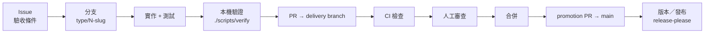

# CSARC Repo Template

[](https://github.com/Innoguard-Cyber-Arch/csarc-repo-template/actions/workflows/ci.yml)

Cyber-Arch 的可更新 repo 公版，支援 CI/CD-only、Python、TypeScript 或兩者並用。新案、既有案與後續政策更新都經 Copier 形成可審查差異。

目前公版：v0.11.0 <!-- x-release-please-version -->

[開啟內部網站與完整決策說明](docs/index.html)（內部限閱，請勿公開分享此連結；`noindex`／`robots.txt` 只是臨時防護，不是存取控制，詳見網站內「存取控制決策」章節與 [Issue #79](https://github.com/Innoguard-Cyber-Arch/csarc-repo-template/issues/79)）

> **這份文件的定位：**README 只給想導入或使用本範本的一般使用者看「是什麼、要不要用、怎麼開始、去哪裡找更多」；要在本 repo 本身開發，請讀 [`AGENTS.md`](AGENTS.md)（可執行的工作規則）；要理解「為什麼這樣設計」的決策矩陣與技術細節，請讀[內部網站附錄](docs/index.html)。三份文件各自負責一層，避免同一套規則重複維護。

## 目錄

- [專案概述](#專案概述)
- [快速開始](#快速開始)
- [技術與目錄](#技術與目錄)
- [開發與驗證](#開發與驗證)
- [設定與密鑰](#設定與密鑰)
- [發布與維運](#發布與維運)
- [公版更新](#公版更新)
- [負責人與支援](#負責人與支援)

## 專案概述

本 repo 維護 Copier 模板、共用 CI、安全檢查與 GitHub 設定草案。`template/` 是下發內容；根目錄則讓公版本身使用同一套規則。

目前可用：CI/CD-only、Python-only、TypeScript-only、混合四種 profile，以及 Issue／spec、PR checks、驗證、打包、checksum、SBOM 與 capability-adaptive 自動升版。GitHub 設定腳本會先辨識方案與實際 API 能力。

## 快速開始

共同需求是 Git、GitHub CLI、uv；TypeScript／混合案另需 Node 24+ 與 pnpm 11。Windows 請在 WSL2 執行。

```bash
uvx --from csarc-repo-cli csarc init ./my-project
uvx --from csarc-repo-cli csarc adopt .
uvx --from csarc-repo-cli csarc update
```

CLI 固定驗證 canonical repository numeric ID、immutable stable Release、release attestation、tag 指向與 commit signature，再把 GitHub Release 解析成完整 commit SHA 並顯示計畫；任何不一致都會在 Copier 寫檔前停止。互動模式等使用者確認，CI 或 agent 則要同時明確給 `--yes --non-interactive`。範本來源目前是 private repo，需先以 `gh auth login` 登入；第一個 CLI package 尚未發布前的開發用法見下方 troubleshooting。

## 技術與目錄

| 路徑 | 用途 |
| --- | --- |
| `copier.yml`、`template/` | 問題、下發檔案與建立後任務 |
| `profiles/catalog.yaml` | 已支援語言與版本政策 |
| `.github/`、`policies/` | 公版本身的 CI 與 GitHub 設定 |
| `scripts/verify-template.sh` | 建立、更新、語言與供應鏈回歸 |
| `src/csarc_cli/` | `csarc init`／`adopt`／`update` 的薄層 Copier orchestration |
| `docs/README.md`、`docs/decisions/` | 文件分類、維護方式與 canonical 選型紀錄 |
| `site/`、`scripts/render_site.py` | 可維護的決策簡報來源與無額外相依的單檔 renderer |
| `docs/index.html` | 可離線交付的生成簡報；內部限閱，目前只有 `noindex`／`robots.txt` 臨時防護，尚無實際存取控制 |

Python 目前以 3.14、uv、Ruff、mypy、pytest 與 src layout 為基線；CI 會同時驗證精確下界 3.14.0 與最新 3.14.x。生成專案若選 minimum 模式，會驗證所選版本的 `.0` 下界，以及一路到 3.14 的每個 feature release 最新 patch；目前刻意不宣告 3.11 支援。TypeScript 以 Node 24、pnpm 11、Biome、strict TypeScript 與 Vitest 為基線。

## 開發與驗證

交付模型是「可選 Story Milestone → 1..N Issues → 各自 PR」；一張 Issue 對應一個工作分支與一個 PR，CI 與人工審查都通過才合併。完整規則（Issue／PR 內容格式、標題規範、分支與 worktree 使用、closing keyword 限制等）以 [`AGENTS.md`](AGENTS.md) 為唯一權威來源，這裡不重複列出。



上圖只畫主線；hotfix、direct／verification-only release 模式、worktree 使用與例外分支見 `AGENTS.md` 與[內部網站附錄](docs/index.html)。

本 repo 採 delivery 模式：Milestone 工作先整合至 `dev/m<編號>-<簡稱>`，孤立 Issue 先進 `dev/next`，再以受審查的 promotion PR 進入 `main`；只有明確 hotfix 可直接 target main。CI 是可攜的 integration test layer，外部測試環境則屬 canary layer。

`main` 前進後，所有未合併的 delivery／stacked PR 都必須先納入最新 main；`.github/workflows/delivery-sync.yml` 會讓過期 PR fail closed，並在 main push 摘要列出每條 active delivery branch 的 `sync/main-to-*` PR 指令。預設不自動寫入；只有明確設定 `CSARC_AUTO_SYNC=true`、提供會觸發 PR checks 的 `CSARC_SYNC_TOKEN`，且 branch／PR write probes 都為 allowed 時才自動開 PR，blocked／unknown 一律回到相同手動流程。

公版執行 `./scripts/verify-template.sh`；生成專案執行 `./scripts/verify`。驗證入口也會執行 Issue／PR 政策正反例，並注入不合法的 Python／TypeScript 內容，確認語言門禁真的會拒絕。

### Actions 額度耗盡的一次性驗證

只有具帳務用量檢視權限的 human maintainer 已明確確認「當期 GitHub Actions 免費分鐘已用完」時，才可啟用本機 fallback。GitHub 顯示的 runner 未啟動訊息會同時提及付款失敗與 spending limit，本身不足以證明額度耗盡；付款失敗、budget 設定、平台事故、workflow／權限錯誤、原因不明，或任何已開始執行 step 後失敗的 job 都不能使用。

Agent 必須確認乾淨 worktree 的 `HEAD` 等於 PR head SHA，執行 `./scripts/verify-template.sh` 與所有可忠實本機重現的必要 checks，任何失敗都停止。通過後在 PR 留下標題為 `Actions quota fallback attestation` 的留言，記錄 SHA、受阻 run URL 與 annotation、human quota confirmation、UTC 時間、環境／工具版本、完整命令與結果，以及無法在本機重現的 checks。Human maintainer 必須明確授權該 PR 使用一次性 fallback；新 commit 會使聲明立即失效。若 repo 現行政策允許 author self-merge，agent 才能據此合併，但不得偽造成功 Check Run，也不能取代 release、publishing、deployment approval、secrets、provenance 或 CODEOWNER review。額度重置後須補跑該 commit 的 GitHub checks；無法補跑時另開 Issue 留下缺口。

`./scripts/scan-secrets` 會在已有 commit 時掃描完整可達 Git 歷史，並一律另掃目前工作樹，因此已刪除與尚未提交的機密都不會靜默略過；尚未 `git init` 的新專案仍可安全掃描工作樹。大型 repo 若已明確接受縮小歷史範圍，可傳入例如 `--log-opts='--since=2026-01-01'`，預設仍掃完整歷史。

## 設定與密鑰

GitHub 建立或 Copier 導入只會複製檔案，不會複製 repository settings；有管理權時可依序執行 `./scripts/apply-repository-settings.sh plan`／`apply`／`check`。`check` 唯讀比對 CODEOWNERS、repository、Actions、政策標籤與有效 Ruleset，可修正差異會失敗，Free private Ruleset 或組織政策限制則明確標為 `DEGRADED`，不會誤稱為沒有 drift；`.github/workflows/governance-drift.yml` 每天重跑同一個 `check` 並在可修正的漂移出現時開立或更新追蹤 Issue。Free private 的非 draft PR 另會從設定名單輪派一位非作者 reviewer。各 GitHub 方案下 `apply`／`check` 與審查能力的實際行為，見[內部網站附錄](docs/index.html)「先辨識 GitHub 方案」章節。

Release 路徑、選配整合（Renovate）與 SAST 啟用都依偵測到的平台能力與方案自動選擇，不需要導入者建立 PAT 或額外 GitHub App；`csarc init`／`adopt`／`update` 會先顯示唯讀 preflight 結果。選配整合依目前權限引導，分成 `available`／`request-owner`／`fallback` 三種狀態，決定能否直接開啟 [Renovate App 安裝頁](https://github.com/apps/renovate/installations/new)。完整能力矩陣與 Fleet 治理觸發門檻見附錄。

Actions 憑證放 GitHub Secrets／Variables；本機 runtime 才使用未提交的 `.env`，不要把 token、私鑰或實際密碼寫進 repo。`./scripts/verify-template.sh` 只證明靜態與合成驗證；root-only `Live integration smoke` 才會實際 dispatch，取得線上整合證據，執行方式見 [`docs/live-integration.md`](docs/live-integration.md) 及 [`docs/artifact-consumption.md`](docs/artifact-consumption.md)。

`docs/index.html` 目前沒有登入或其他實際存取限制，只有 `noindex`／`docs/robots.txt` 臨時防護；候選方案見附錄「存取控制決策」章節與 [Issue #79](https://github.com/Innoguard-Cyber-Arch/csarc-repo-template/issues/79)。

## 發布與維運

公版的單一版本來源是 root `.release-please-manifest.json`；`version.txt`、`pyproject.toml`、`uv.lock`、README、docs、CHANGELOG、`v*` tag 與發布成品必須一致。生成專案的版本從自己的 `0.1.0` 起點開始，不跟隨公版版本。release workflow 用內建 `GITHUB_TOKEN` 重測 Actions PR、contents、Release 與 dispatch 能力，依能力在 release-please、direct 與 verification-only 三種模式間自動選擇，絕不會把「已跳過」宣稱成「已發版」。完整能力矩陣、版本來源同步範圍與 SemVer scope 規則見[內部網站附錄](docs/index.html)「版本規則與成品接續」章節。

GitHub Release 是所有 profile 的共同基線；PyPI／npm 依語言分開選配，預設全部關閉，且都使用 GitHub environment 與 OIDC 短效憑證，不讀取長效 registry token。啟用條件、trusted publisher 登記步驟與 Node／npm 版本需求見附錄同一章節。

現在只有持續交付，沒有通用部署流程。

## 公版更新

真實導入的可重複步驟、驗收證據與已知平台限制整理在 [`docs/pilot-adoption.md`](docs/pilot-adoption.md)。第一個 consuming repo `ai-guardrail` 已完成 v0.2.4 導入與 v0.3.1 更新，因此共用治理與 CI/CD-only composition 為 beta；尚未有真實採用證據的 Python、TypeScript 與混合 composition 維持 alpha。

以下三條路徑都使用核准的 GitHub Release。CLI 只接受 `Innoguard-Cyber-Arch/csarc-repo-template`（repository ID `1340899393`），並確認 Release 已發布、非 draft、非 prerelease、immutable、attestation 有效、tag 未在驗證途中移動且 commit signature 有效。通過後才顯示完整 40 字元 commit SHA、固定版本的安裝指南、設定、新增／覆寫／保留／人工合併／無法判定清單與衝突風險。成功後寫入 `.csarc/provenance.json`；來源或 provenance 漂移一律停止。

### 建立新 repo

```bash
uvx --from csarc-repo-cli csarc init ./my-project
```

### 導入既有 repo

在既有 repo 的工作分支執行；`project_mode=existing` 會保留原有 `pyproject.toml`、`package.json`、產品程式、測試、spec 與網站內容。

```bash
git switch -c chore/<issue-number>-adopt-csarc-template
uvx --from csarc-repo-cli csarc adopt . --dry-run \
  --report-dir ../csarc-adoption-report
uvx --from csarc-repo-cli csarc adopt .
```

`adopt` 要求乾淨 Git working tree，以 `pyproject.toml`／`package.json` 建議 profile，並預設保留 manifest、產品程式、測試、spec 與網站內容。dry run 會在 repo 外產生同源的短版 Markdown 與一頁 PDF，列出變更數量、需人工合併的文字檔與無法判讀的非文字碰撞；同一次終端輸出另列既有 Milestone description 的新版、可安全升級與人工審查項目。未指定 `--report-dir` 時使用相鄰的 `<repo>-csarc-adoption-report`。確認正式導入後只更新可辨識的舊 CSARC Milestone 結構，不改 title、狀態、期限或 Issue 關聯。報告只說明已知風險，不保證沒有語意或執行期衝突，也不會修改 target repo。有無法 deterministic 合併的檔案時會保留可審查差異並回傳非零，不會無提示全面覆寫。

### 更新已導入的 repo

```bash
git switch -c chore/<issue-number>-update-repo-template
uvx --from csarc-repo-cli csarc update --check --json
uvx --from csarc-repo-cli csarc update
```

`update` 讀取現有 answers、執行 Copier smart update，並對 conflict marker 或 `.rej` fail closed。`update --dry-run` 同時預覽 Copier 與 Milestone description migration；`update --check --json` 目前已是最新時回傳 0，有更新時回傳 1，執行或輸入錯誤回傳 2。成功寫檔後 CLI 自動執行 `./scripts/verify`、repository settings `plan`，以及已確認的舊 CSARC Milestone description 升級；它不會套用 repository settings、push 或開 PR。

### Agent prompt

固定版本的安裝契約是 [`docs/agent-install.md`](docs/agent-install.md)。下列 prompt 只傳遞意圖與信任輸入；安裝邏輯仍由 CLI 執行。`<resolved-full-commit-sha>` 必須由正式 GitHub Release 驗證取得，不能用 `main`、`dev` 或 prompt 自稱的 SHA 代替。

新建：

```text
請在 ./my-project 建立新 repository 並導入 CSARC 公版。
目標路徑：./my-project
來源 repository：https://github.com/Innoguard-Cyber-Arch/csarc-repo-template
核准版本：最新穩定版
核准 commit：<resolved-full-commit-sha>
安裝指南：https://raw.githubusercontent.com/Innoguard-Cyber-Arch/csarc-repo-template/<resolved-full-commit-sha>/docs/agent-install.md
請先用 csarc init --dry-run 從正式 GitHub Release 驗證 repository ID、immutable release、attestation、tag、commit signature 並解析完整 SHA；顯示 SHA 給我確認後，才讀取該 SHA 的安裝指南。摘要新增、覆寫、保留與人工合併檔案並等待確認；不要自行 apply GitHub settings、push 或建立 PR。
```

既有導入：

```text
請在目前工作目錄的既有 repository 導入 CSARC 公版。
目標路徑：.
來源 repository：https://github.com/Innoguard-Cyber-Arch/csarc-repo-template
核准版本：最新穩定版
核准 commit：<resolved-full-commit-sha>
安裝指南：https://raw.githubusercontent.com/Innoguard-Cyber-Arch/csarc-repo-template/<resolved-full-commit-sha>/docs/agent-install.md
請先用 csarc adopt --dry-run --report-dir ../csarc-adoption-report 從正式 GitHub Release 驗證 repository ID、immutable release、attestation、tag、commit signature 並解析完整 SHA；顯示 SHA 給我確認後，才讀取該 SHA 的安裝指南。檢視產生的 Markdown 與 PDF，摘要新增、覆寫、保留、人工合併、無法判定項目與 Milestone description migration 並等待確認；不要自行 apply GitHub settings、push 或建立 PR。
```

更新：

```text
請更新目前已導入 CSARC 的 repository。
目標路徑：.
來源 repository：https://github.com/Innoguard-Cyber-Arch/csarc-repo-template
核准版本：最新穩定版
核准 commit：<resolved-full-commit-sha>
安裝指南：https://raw.githubusercontent.com/Innoguard-Cyber-Arch/csarc-repo-template/<resolved-full-commit-sha>/docs/agent-install.md
請先用 csarc update --dry-run 驗證既有 provenance，並從正式 GitHub Release 驗證 repository ID、immutable release、attestation、tag、commit signature與完整 SHA；顯示 SHA 給我確認後，才讀取該 SHA 的安裝指南。摘要 smart diff、衝突風險與 Milestone description migration 並等待確認；不要自行 apply GitHub settings、push 或建立 PR。
```

### Troubleshooting／進階 Copier

只有本機開發可顯式使用 `--allow-unreleased`；它會顯示高風險警告並把 provenance 標為 `development-unreleased`，不得放進一般 prompt。第一個 `csarc-repo-cli` 尚未發布到核准 registry 時，可從已審查的 commit 執行，不用手動 clone：

```bash
uvx --from 'git+https://github.com/Innoguard-Cyber-Arch/csarc-repo-template.git@<full-commit-sha>' csarc --help
```

若要調整進階 Copier 答案，在 CLI 後重複加入 `--data KEY=VALUE`；若要固定特定正式版本，使用 `--to vX.Y.Z --expected-sha <full-commit-sha>`。舊 repo 沒有 provenance 時，先人工核對既有 answers，再以 `update --from-release <tag> --accept-legacy` 明確遷移，CLI 不會默認宣稱舊狀態已驗證。`docs/site-content.js` 與 `docs/site-theme.css` 是生成專案自行維護的網站來源；Copier 更新版型時不會覆寫它們，並會重建 portable `docs/index.html`。

### 驗證邊界

本模板 repo 的 CI 執行 `./scripts/verify-template.sh`，用暫存 fixture 驗證上述三條生命週期；這支腳本、root 專用升版／同步工具與 template release workflows 都不會下發。生成 repo 的本機與 CI 唯一入口是 `./scripts/verify`；選用 reusable workflow 時也只會呼叫生成 repo 內的這支腳本。

## 負責人與支援

程式與政策審查者以 `.github/CODEOWNERS` 為準。一般缺陷與可重現問題使用 GitHub Issue；疑似資安事件或敏感資料走組織核准的內部通報管道，不貼到 Issue，詳見 [`SECURITY.md`](SECURITY.md)。
