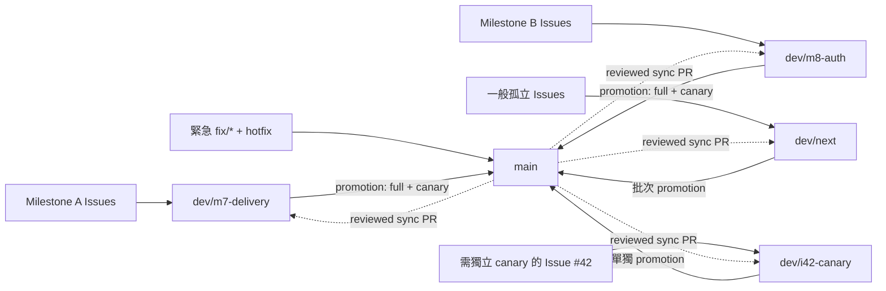

# CSARC Repo Template

Cyber-Arch 的可更新 repo 公版，支援只使用共通流程，或獨立選擇 Python、Rust、TypeScript。新案、既有案與後續政策更新都經 Copier 形成可審查差異。

目前公版：v0.12.2 <!-- x-release-please-version -->

> [!IMPORTANT]
> Milestone 8 正在逐頁重定義產品規格。目前只有已審查且位於 `.github/workflows/` 的流程會執行；其他流程仍封存。各階段的啟用狀態以[CI/CD 設定](docs/index.html#testing)為準。

[開啟內部網站與完整決策說明](docs/index.html)（內部限閱，請勿公開分享此連結；`noindex`／`robots.txt` 只是臨時防護，不是存取控制，詳見網站內「存取控制決策」章節與 [Issue #79](https://github.com/Innoguard-Cyber-Arch/csarc-repo-template/issues/79)）

> **這份文件的定位：**README 只給想導入或使用本範本的一般使用者看「是什麼、要不要用、怎麼開始、去哪裡找更多」；要在本 repo 本身開發，請讀 [`AGENTS.md`](AGENTS.md)（可執行的工作規則）；要理解「為什麼這樣設計」的決策矩陣與技術細節，請讀[內部網站附錄](docs/index.html)。三份文件各自負責一層，避免同一套規則重複維護。

## 目錄

- [專案概述](#專案概述)
- [快速開始](#快速開始)
- [技術與目錄](#技術與目錄)
- [開發與驗證](#開發與驗證)
- [設定與密鑰](#設定與密鑰)
- [發布與維運](#發布與維運)
- [公版更新](#公版更新)
- [負責人與支援](#負責人與支援)

## 專案概述

本 repo 維護 Copier 模板、共用 CI、安全檢查與 GitHub 設定草案。`template/` 是下發內容；根目錄則讓公版本身使用同一套規則。

目前可用：共通 CI/CD 與可獨立勾選的 Python、Rust、TypeScript 語言模組，以及 Issue／spec、PR checks、驗證、打包、checksum、SBOM、選配容器驗證／GHCR 交付與 capability-adaptive 自動升版。GitHub 設定腳本會先辨識方案與實際 API 能力。

## 快速開始

共同需求是 Git、GitHub CLI、uv；選 Rust 另需 rustup，選 TypeScript 另需 Node 24+ 與 pnpm 11。CSARC 交付的是 CI/CD 範本與治理流程，Python 只用來執行 init／adopt／update 的薄 CLI；`uvx --python 3.14` 會按次取得隔離 runtime，不要求使用者預先安裝或維護全域 Python。Windows 請在 WSL2 執行。

請從實際 Git root 開啟 Codex／agent workspace；從 repo 上層開啟時，子目錄的 `AGENTS.md` 不一定會自動載入。開始前先在工作目錄執行 `test "$(git rev-parse --show-toplevel)" = "$(pwd -P)"`，失敗就切換到輸出的 Git root，不要複製另一份指引到父目錄。

```bash
uvx --python 3.14 --from 'git+https://github.com/Innoguard-Cyber-Arch/csarc-repo-template.git@<approved-full-commit-sha>' csarc init ./my-project
uvx --python 3.14 --from 'git+https://github.com/Innoguard-Cyber-Arch/csarc-repo-template.git@<approved-full-commit-sha>' csarc adopt
uvx --python 3.14 --from 'git+https://github.com/Innoguard-Cyber-Arch/csarc-repo-template.git@<approved-full-commit-sha>' csarc update --check --json
```

`<approved-full-commit-sha>` 由核准 GitHub Release 的 pinned prompt 提供，不可直接輸入預留字樣。`init`／`adopt` 會要求 `project_description`、`project_run_command` 與 `security_reporting_channel`；前兩項可接受顯示的專案實值預設，安全通報管道預設使用該 repository 的公開 GitHub Issues。公開 Issue 不得張貼 secrets、credentials、personal data 或其他敏感內容，也不得猜測 email 或回應 SLA。GitHub origin 可辨識時，CLI 會用實際 repository URL 產生 badge、clone 指令與 package metadata。`project_run_command` 只是產品啟動方式，不會被當成驗證指令；既有 repo 可用 `project_verification_hook=scripts/verify-skills` 指定一個 repository-relative executable，未指定時才相容沿用 `scripts/verify-product`。

建立或導入時選擇 Python、Rust、TypeScript 的任意組合；結果與分支、驗證、發布等公版選項都保存在 `.csarc/config.yml`。這同時是 Copier 的 answers file，也是 repo 唯一的公版設定來源；請用 `csarc update --data languages=python,rust` 等更新命令調整，不要再建立另一份 profile 設定。

CLI 固定驗證 canonical repository numeric ID、immutable stable Release、release attestation、tag 指向與 commit signature，再把 GitHub Release 解析成完整 commit SHA 並顯示計畫；任何不一致都會在 Copier 寫檔前停止。互動模式等使用者確認，CI 或 agent 則要同時明確給 `--yes --non-interactive`。範本來源目前是 private repo，需先以 `gh auth login` 登入；root CLI 不發布到 PyPI。

## 技術與目錄

| 路徑 | 用途 |
| --- | --- |
| `copier.yml`、`template/` | 問題、下發檔案與建立後任務 |
| `.csarc/config.yml`（生成 repo） | Copier 來源／版本與公版選項的單一設定來源 |
| `profiles/catalog.yaml` | 已支援語言與版本政策 |
| `.github/`、`policies/` | 公版本身的 CI 與 GitHub 設定 |
| `scripts/verify-template.sh` | 建立、更新、語言與供應鏈回歸 |
| `src/csarc_cli/` | `csarc init`／`adopt`／`update` 的薄層 Copier orchestration |
| `docs/README.md`、`docs/specs/`、`docs/adr/` | Durable Project Memory 地圖、Spec-Driven Development（SDD）規格與 Architecture Decision Records（ADR） |
| `site/`、`scripts/build-decision-site` | Hugo 內容、模板、樣式與可重現的單檔建置入口 |
| `docs/index.html`、`docs/index.en.html` | 可離線交付的中英文生成簡報；目前只有 `noindex`／`robots.txt` 臨時防護，尚無實際存取控制 |

Python 目前以 3.14、uv、Ruff、ty、pytest 與 src layout 為基線；CI 會同時驗證精確下界 3.14.0 與最新 3.14.x。生成專案若選 minimum 模式，會驗證所選版本的 `.0` 下界，以及一路到 3.14 的每個 feature release 最新 patch；目前刻意不宣告 3.11 支援。Rust 以 1.98、Cargo.lock、rustfmt、Clippy、cargo test 與 release build 為基線。TypeScript 以 Node 24、pnpm 11、Biome、strict TypeScript 與 Vitest 為基線。

模板的 Durable Project Memory 同時支援 SDD、ADR、Test-Driven Development（TDD）的回歸證據與 Behavior-Driven Development（BDD）的必要行為情境；完整分工與導航見 [`docs/README.md`](docs/README.md)。

## 開發與驗證

工作模型是「SDD → Feature parent → Task／Bug subissues → 各自 PR」，交付時才把 leaf Issues 與 PR 放進有 due date 的 Milestone；一張 leaf Issue 對應一個原生 Development branch 與一個 PR，CI 與人工審查都通過才合併。GitHub Projects 預設關閉。完整規則（Issue／PR 內容格式、標題規範、關係、分支與 worktree 使用、closing keyword 限制等）以 [`AGENTS.md`](AGENTS.md) 為唯一權威來源，這裡不重複列出。

本 repo 採 delivery 模式：可同時有多條 Milestone delivery branch；一般孤立 Issue 進入 `dev/next`，確實需要獨立 soak／canary 時才使用一次性的 `dev/i<Issue 編號>-<簡稱>`。它們都以受審查的 promotion PR 進入 `main`；只有明確 hotfix 可直接 target main。CI 是可攜的 integration test layer，外部測試環境則屬 canary layer。



`main` 前進後，所有未合併的 delivery／stacked PR 都必須先納入最新 main；PR policy 會在既有 `title` runner 內 fail closed，`.github/workflows/delivery-maintenance.yml` 則在 trusted main push 摘要列出每條 active delivery branch 的 `sync/main-to-*` PR 指令並使過期 policy 失效。預設不自動寫入；只有明確設定 `CSARC_AUTO_SYNC=true`、提供會觸發 PR checks 的 `CSARC_SYNC_TOKEN`，且 branch／PR write probes 都為 allowed 時才自動開 PR，blocked／unknown 一律回到相同手動流程。

公版的完整入口是 `./scripts/verify-template.sh`；生成專案使用 `./scripts/verify`。現行 `.github/workflows/ci.yml` 只有一個 `verify` job，依變更選擇 docs／fast／full，再呼叫同一份 repo-local 程式；一般 PR 不會為 fast、full、安全與 aggregate 各啟動一個 runner。promotion、hotfix、release recovery、merge queue 與手動執行採 full，單一 job timeout 為 30 分鐘。詳細分級與目前封存邊界見 [`docs/ci-policy.md`](docs/ci-policy.md)。

Dependabot、PR 條件式 OSV 與每週／手動 OSV 掃描已啟用。專用的 promotion、release、Zizmor、remote governance、deployment 與其他 schedule workflows 仍在 `archive/ci-cd/2026-08-27/`；文件中的目標政策不代表尚未移出的 Action 已啟用。

### Actions 額度耗盡的一次性驗證

只有 GitHub Actions 的 zero-step billing block 被機械式確認、且本機驗證通過時，才可能使用本機 fallback；runner 註記本身不構成證據。一般 Issue PR 留一則說明留言即可合併，不需要即時人工確認；Promotion 到 `main` 仍維持 human attestation/authorization 雙方確認，另須綁定 candidate tree、合併後核對 tree identity，且本機證據不可用於 release。完整流程只有一份，見 [`docs/ci-policy.md`](docs/ci-policy.md#actions-額度-fallback)。

`./scripts/scan-secrets` 會在已有 commit 時掃描完整可達 Git 歷史，並一律另掃目前工作樹，因此已刪除與尚未提交的機密都不會靜默略過；尚未 `git init` 的新專案仍可安全掃描工作樹。大型 repo 若已明確接受縮小歷史範圍，可傳入例如 `--log-opts='--since=2026-01-01'`，預設仍掃完整歷史。

## 設定與密鑰

GitHub 建立或 Copier 導入只會複製檔案，不會複製 repository settings；有管理權時可依序執行 `./scripts/apply-repository-settings.sh plan`／`apply`／`check`。`check` 唯讀比對 CODEOWNERS、repository、Actions、政策標籤與有效 Ruleset，可修正差異會失敗，Free private Ruleset 或組織政策限制則明確標為 `DEGRADED`，不會誤稱為沒有 drift；`.github/workflows/governance-drift.yml` 每天重跑同一個 `check` 並在可修正的漂移出現時開立或更新追蹤 Issue。Free private 的非 draft PR 另會從設定名單輪派一位非作者 reviewer。各 GitHub 方案下 `apply`／`check` 與審查能力的實際行為，見[內部網站附錄](docs/index.html)「先辨識 GitHub 方案」章節。

Release 路徑、選配整合（Renovate）與 SAST 啟用都依偵測到的平台能力與方案自動選擇，不需要導入者建立 PAT 或額外 GitHub App；`csarc init`／`adopt`／`update` 會先顯示唯讀 preflight 結果。選配整合依目前權限引導，分成 `available`／`request-owner`／`fallback` 三種狀態，決定能否直接開啟 [Renovate App 安裝頁](https://github.com/apps/renovate/installations/new)。完整能力矩陣與 Fleet 治理觸發門檻見附錄。

Actions 憑證放 GitHub Secrets／Variables；本機 runtime 才使用未提交的 `.env`，不要把 token、私鑰或實際密碼寫進 repo。`./scripts/verify-template.sh` 只證明靜態與合成驗證；root-only `Live integration smoke` 才會實際 dispatch，取得線上整合證據，執行方式見 [`docs/live-integration.md`](docs/live-integration.md) 及 [`docs/artifact-consumption.md`](docs/artifact-consumption.md)。

`docs/index.html` 目前沒有登入或其他實際存取限制，只有 `noindex`／`docs/robots.txt` 臨時防護；候選方案見附錄「存取控制決策」章節與 [Issue #79](https://github.com/Innoguard-Cyber-Arch/csarc-repo-template/issues/79)。

## 發布與維運

公版的單一版本來源是 root `.release-please-manifest.json`；`version.txt`、`pyproject.toml`、`uv.lock`、README、docs、CHANGELOG、`v*` tag 與發布成品必須一致。`template/.release-please-manifest.json` 與模板內的 package/version 檔則是新生成專案自己的 `0.1.0` 起點，不跟隨公版 release number。Promotion 已完成完整驗證；release workflow 只接受綁定該 main SHA 的 source evidence，再從 exact tag 建置、以固定 Syft 版本產生 SPDX JSON SBOM，並把 artifact digest、manifest 與 provenance 綁定後驗證 immutable Release；不重跑完整模板與 runtime 矩陣，也不以 Syft 輸出 byte-identical 作為再現性假設。生成專案依所選語言模組驗證 wheel、npm tarball、Cargo package 或其組合；Rust 目前不發布 crates.io。所有 profile（含 CI/CD-only）都會把來源封存檔、`SHA256SUMS`、SPDX SBOM 與 tag／commit／workflow run metadata 附加至 GitHub Release；CI/CD-only 不假裝有語言成品。已有產品 Containerfile 的既有 repo 可另選 `verify` 或 `ghcr`：前者只在 PR build／smoke／scan，後者才從已驗證 release source 將相同映像 bytes 發布至 GHCR、附加 provenance 與 SPDX SBOM，並以 digest 再測一次。attestation 產生後，只有明確啟用的 registry 路徑會在發布時強制驗證；一般下載仍由消費者執行 `gh attestation verify`。這仍是持續交付，不包含通用 runtime 部署。

GitHub Release 是所有 profile 的共同基線；PyPI／npm 依語言分開選配，GHCR 則只供已有 Containerfile 的既有 repo 選配，預設全部關閉，且不讀取長效 registry token。容器選項是 `none`、`verify`、`ghcr`；非容器專案不會取得 Docker job 或 `packages: write`。啟用條件、trusted publisher 登記步驟與 Node／npm 版本需求見附錄同一章節。

| Runtime 實測政策 | 模式與行為 | 保證、限制與 fallback |
| --- | --- | --- |
| PR、contents、Release、dispatch 都是 `allowed` | **Release PR：**release-please 維護可審查的版本／changelog PR；合併後建立 release 並明確 dispatch 成品 workflow | 保留最強的人類審查與來源 metadata 同步；任一必要能力漂移就不再選此模式 |
| PR 是 `blocked`／`unknown`，其餘三項都是 `allowed` | **Direct：**只由最新 `main` 配置 tag 與 draft release，再 dispatch 成品 workflow | 最新 commit 必須已由人工 PR 寫入正確版本與 CHANGELOG；否則 fail closed 為 verification-only |
| contents、Release 或 dispatch 任一不是 `allowed` | **Verification only：**保留測試與 machine-readable capability artifact，不建立 tag 或 release | 不會把不確定權限當成功；政策恢復後由後續 main run 重新計算並接續 |

GitHub Release 是所有專案的共同基線；registry 則依所選語言模組分開選配：Python 可開 PyPI、TypeScript 可開 npm，同時選取時可分別啟用；Rust 目前只驗證 Cargo package，不發布 crates.io。Root `csarc-repo-cli` 只隨 GitHub Release 交付，不發布到 PyPI，也沒有 registry publishing job。生成專案啟用 PyPI／npm 前，package owner 必須在 registry 登記完全相符的 organization／repository、workflow `release.yml` 與 environment；兩者都使用 OIDC 短效憑證，不讀取長效 registry token。PyPI 首次發布可先建立 pending publisher；npm 則需由既有 package owner 建立 trusted publisher，並使用 GitHub-hosted runner、Node 22.14+ 與 npm 11.5.1+。

整份公版只用一個 SemVer：`fix(scope)` 升 patch、`feat(scope)` 升 minor、`!` 升 major。scope 可標 `ci`、`python`、`typescript` 或 `template`；只要任何已支援 profile 不相容，就視為整份公版的破壞性變更。

release workflow 用內建 `GITHUB_TOKEN` 重測能力：支援時由 release-please 自動開、更新 Release PR；目前組織政策禁止 Actions PR 時，由維護者先開版本／CHANGELOG PR，合併後 direct mode 才能在最新 `main` 建立 draft 與 tag。Milestone 原則上在完成時 promotion 一次；只有後續驗收明確依賴同一 Milestone 的 immutable Release，才使用受約束的 checkpoint promotion。`dev/next` 預設由維護團隊每週固定一個 release window 批次 promotion，沒有 release-worthy 變更就略過；hotfix 才立即發版。整批 SemVer 取納入 PR 的最高意圖，全部為 no-release 時不建立空版本。兩種 release 模式都只從已核對的 release-source run 明確 dispatch `release-template.yml`；任意 tag push 不會啟動發布。發布 workflow 不會再於 checkout 後暫時改寫版本；它會先驗證 tagged source、CHANGELOG、tag 與 promotion evidence 一致，再附加 wheel、sdist、release-specific prompt 與 provenance，最後發布並鎖定 immutable GitHub Release；任一步驟失敗都保留 draft。發布後會以 `gh release verify` 重新驗證 attestation。一般 main push 不會重複發版。完整批次與追溯規則見 [`docs/ci-policy.md`](docs/ci-policy.md)。

## 公版更新

真實導入的可重複步驟、驗收證據與已知平台限制整理在 [`docs/pilot-adoption.md`](docs/pilot-adoption.md)。第一個 consuming repo `ai-guardrail` 已完成 v0.2.4 導入與 v0.3.1 更新，證明共用導入、更新與線上 CI 路徑；Python、Rust、TypeScript 則各以可重現的建立、既有 repo 導入、更新與原生工具鏈驗證取得 beta。同時選取多個模組不會形成另一種 profile。

以下三條路徑都使用核准的 GitHub Release。CLI 只接受 `Innoguard-Cyber-Arch/csarc-repo-template`（repository ID `1340899393`），並確認 Release 已發布、非 draft、非 prerelease、immutable、attestation 有效、tag 未在驗證途中移動且 commit signature 有效。通過後才顯示完整 40 字元 commit SHA、固定版本的安裝指南、設定、新增／覆寫／保留／人工合併／無法判定清單與衝突風險。成功後寫入 `.csarc/provenance.json`；來源或 provenance 漂移一律停止。

### 建立新 repo

```bash
uvx --python 3.14 --from 'git+https://github.com/Innoguard-Cyber-Arch/csarc-repo-template.git@<approved-full-commit-sha>' csarc init ./my-project
```

### 導入既有 repo

在既有 repo 的工作分支執行；`project_mode=existing` 會保留原有 `pyproject.toml`、`package.json`、產品程式、測試、spec 與網站內容。

```bash
git switch -c chore/<issue-number>-adopt-csarc-template
uvx --python 3.14 --from 'git+https://github.com/Innoguard-Cyber-Arch/csarc-repo-template.git@<approved-full-commit-sha>' csarc adopt
uvx --python 3.14 --from 'git+https://github.com/Innoguard-Cyber-Arch/csarc-repo-template.git@<approved-full-commit-sha>' csarc adopt \
  --apply-plan ../<repo>-csarc-adoption-report/csarc-adoption-plan.json
```

`adopt` 預設就是 dry-run；明確寫出 `--dry-run` 仍相容。它只產生 repo 外的 Markdown、PDF 與 machine-readable plan，不修改 repo。若 dirty path 全部是未 staged 的 tracked modification 且由 plan 明列為 `preserve`，CLI 會用原始 bytes 建立並驗證候選，允許套用同一份 plan；其他 dirty 狀態只能審查。plan 鎖定 target HEAD、完整 working-tree 狀態、Release full SHA、answers 與輸出 digest，任何漂移都會停止。CLI 會先在暫存 clone 產生完整候選、執行驗證與 patch check，成功後才改目標 repo。README／CHANGELOG 保留為 project-owned，`.gitignore` 使用 ordered union，`AGENTS.md` 只更新 CSARC managed block，產品既有 `release.yml` 則與 `csarc-release.yml` 分離。

導入時可以 `--data project_verification_hook=scripts/verify-skills` 指定產品驗證。該值必須是 repo 內存在、可執行的相對檔案，不會透過 shell 解析，也不得解析成或間接呼叫 canonical `scripts/verify`；plan、Markdown 與 PDF 都會列出精確路徑、結果與原因。沒有顯式設定時，只在既有 `scripts/verify-product` 可執行時使用相容 fallback；同一路徑只執行一次。`update --check` 會先驗證設定，正式 update 則在暫存 clone 通過 canonical 與產品驗證後才寫入 target。

若第一階段列出 manual merge，先完成清單中的人工結果，再執行 `adopt --finalize`；它同樣預設為 dry-run，會重建並驗證完整候選，將人工結果與完整 working-tree state 綁進同一個 repo 外 plan。確認後只能用 `adopt --finalize --apply-plan ../<repo>-csarc-adoption-report/csarc-adoption-plan.json` 套用；任何 plan 後漂移都會停止。

### 更新已導入的 repo

```bash
git switch -c chore/<issue-number>-update-repo-template
uvx --python 3.14 --from 'git+https://github.com/Innoguard-Cyber-Arch/csarc-repo-template.git@<approved-full-commit-sha>' csarc update --check --json
uvx --python 3.14 --from 'git+https://github.com/Innoguard-Cyber-Arch/csarc-repo-template.git@<approved-full-commit-sha>' csarc update
```

`update` 讀取現有 answers、執行 Copier smart update，並對 conflict marker 或 `.rej` fail closed。若有衝突，CLI 會列出檔案但不修改 target；請在目前分支調整衝突內容後重跑。`update --dry-run` 同時預覽 Copier 與 Milestone description migration；`update --check --json` 目前已是最新時回傳 0，有更新時回傳 1，執行或輸入錯誤回傳 2。成功寫檔後 CLI 自動執行 `./scripts/verify`、repository settings `plan`，以及已確認的舊 CSARC Milestone description 升級；它不會套用 repository settings、push 或開 PR。

### Agent prompt

固定版本的安裝契約是 [`docs/agent-install.md`](docs/agent-install.md)。下列三個 prompt 只選擇 lifecycle；CLI 會從 canonical immutable Release 解析並驗證 full SHA，再把它鎖進 plan 與 provenance。需要預先固定版本時，改用 Release 附件中的三個 pinned prompts。

新建：

```text
請使用 uv 從 canonical GitHub repository 的核准 release commit 執行官方 csarc CLI，在目前 workspace 建立新的 CSARC repository；uv 應按次管理隔離的 Python 3.14，不要求全域 Python。自行依工作脈絡判斷名稱與位置，無法唯一判斷時先詢問。先驗證 canonical immutable Release 並顯示 tag 與 full SHA，只執行 init dry-run、摘要 plan 並等待確認；確認後使用相同 tag 與 SHA 正式建立及驗證。不要修改全域環境、套用 GitHub settings、push 或開 PR。
```

既有導入：

```text
請使用 uv 從 canonical GitHub repository 的核准 release commit 執行官方 csarc CLI，把 CSARC 導入目前開啟的既有 Git repository；uv 應按次管理隔離的 Python 3.14，不要求全域 Python。自行判斷 repo root。先驗證 canonical immutable Release 並顯示 tag 與 full SHA，只執行 adopt dry-run、檢視 repo 外報告、摘要 plan 並等待確認；不要 stash、commit 或修改既有工作。確認後只套用 dry-run 產生且未漂移的 machine plan，再執行驗證。不要套用 GitHub settings、push 或開 PR。
```

更新：

```text
請使用 uv 從 canonical GitHub repository 的核准 release commit 執行官方 csarc CLI，更新目前開啟且已導入 CSARC 的 Git repository；uv 應按次管理隔離的 Python 3.14，不要求全域 Python。自行判斷 repo root。先驗證既有 provenance 與 canonical immutable Release，顯示目前及目標 tag／full SHA，只執行 update check 與 dry-run、摘要 smart diff 和風險並等待確認；確認後使用相同目標 tag 與 SHA 更新及驗證。不要修改全域環境、套用 GitHub settings、push 或開 PR。
```

### Troubleshooting／進階 Copier

Root CLI 不發布到 package registry；正式 prompt 一律從核准 GitHub Release 的 full commit SHA 執行。只有本機開發可顯式使用 `--allow-unreleased`；它會顯示高風險警告並把 provenance 標為 `development-unreleased`，不得放進一般 prompt。若要檢查已審查但尚未發布的開發 commit，不用手動 clone：

```bash
uvx --python 3.14 --from 'git+https://github.com/Innoguard-Cyber-Arch/csarc-repo-template.git@<full-commit-sha>' csarc --help
```

若要調整進階 Copier 答案，在 CLI 後重複加入 `--data KEY=VALUE`；若要固定特定正式版本，使用 `--to vX.Y.Z --expected-sha <full-commit-sha>`。舊 repo 沒有 provenance 時，先人工核對既有 answers，再以 `update --from-release <tag> --accept-legacy` 明確遷移，CLI 不會默認宣稱舊狀態已驗證。`docs/site-content.js` 與 `docs/site-theme.css` 是生成專案自行維護的網站來源；Copier 更新版型時不會覆寫它們，並會重建 portable `docs/index.html`。

### 驗證邊界

本模板 repo 的 CI 執行 `./scripts/verify-template.sh`，用暫存 fixture 驗證上述三條生命週期；這支腳本、root 專用升版／同步工具與 template release workflows 都不會下發。生成 repo 的本機與 CI 唯一入口是 `./scripts/verify`；選用 reusable workflow 時也只會呼叫生成 repo 內的這支腳本。

## 負責人與支援

程式與政策審查者以 `.github/CODEOWNERS` 為準。一般問題與疑似資安問題依 [`SECURITY.md`](SECURITY.md) 建立公開 GitHub Issue，維護者會收到通知；不得張貼 secrets、credentials、personal data 或其他敏感內容。
