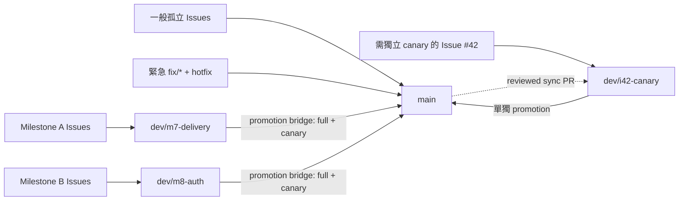

# CSARC Repo Template

[English](README.en.md)

Cyber-Arch 的可更新 repo 公版：建立新案、導入既有案、接收政策更新，都先驗證再由 PR 合併。可以只使用共通流程，或獨立選擇 Python、Rust、TypeScript。

| 項目 | 目前狀態 |
| --- | --- |
| 公版版本 | v0.24.2<!-- x-release-please-version --> |
| 支援語言 | Python、Rust、TypeScript（可獨立複選；都不選時只使用共通流程） |
| repo-site 排版模板版本 | 1.1.0 |
| repo-site 渲染引擎版本 | 1.1.0 |

> [!IMPORTANT]
> Milestone 13 正在擴充 repo-site 與導入體驗。目前只有已審查且位於 `.github/workflows/` 的流程會執行；其他流程仍封存。各階段的啟用狀態以[CI/CD 設定](docs/index.html#testing)為準。

| 可以直接選擇 | 目前提供的正式能力 |
| --- | --- |
| 程式語言 | Python、Rust、TypeScript 可獨立複選；都不選時只使用共通工作流程 |
| 分支做法 | 每個交付批次有自己的開發分支、所有修改直接進 `main`，或先集中到 `dev` |
| 公版設定 | 建立／導入時把選項寫入 `.csarc/config.yml`；之後由公版更新，不必到不同檔案重複設定 |
| 共用能力 | 工作單（Issue）與變更提案（PR）表單、AI 工作規範、自動驗證、依賴安全、版本記錄與公版更新 |

README 是 [repo-site](docs/index.html) 的濃縮入口；兩者維持相同的公開事實，不要求逐字或逐段相同。這個 repository 與 [GitHub Pages repo-site](docs/index.html) 目前均為公開可讀。`noindex`／`robots.txt` 只能降低搜尋引擎索引，不能限制讀取或分享；過渡紀錄見 [Issue #79](https://github.com/Innoguard-Cyber-Arch/csarc-repo-template/issues/79)，後續 hosting／access-control 決策留在 [Issue #425](https://github.com/Innoguard-Cyber-Arch/csarc-repo-template/issues/425)。

> **這份文件的定位：** README 只給想導入或使用本範本的一般使用者看「是什麼、要不要用、怎麼開始、去哪裡找更多」；要在本 repo 本身開發，請讀 [`AGENTS.md`](AGENTS.md)（可執行的工作規則）；要理解「為什麼這樣設計」的決策矩陣與技術細節，請讀 [repo-site 附錄](docs/index.html)。三份文件各自負責一層，避免同一套規則重複維護。

## 目錄

- [專案概述](#專案概述)
- [快速開始](#快速開始)
- [前置需求](#前置需求)
- [技術與目錄](#技術與目錄)
- [開發與驗證](#開發與驗證)
- [設定與密鑰](#設定與密鑰)
- [發布與維運](#發布與維運)
- [公版更新](#公版更新)
- [負責人與支援](#負責人與支援)
- [授權](#授權)

## 專案概述

本 repo 維護 Copier 模板、共用 CI、安全檢查與 GitHub 設定草案。`template/` 是下發內容；根目錄則讓公版本身使用同一套規則。

目前可用：共通 CI/CD 與可獨立勾選的 Python、Rust、TypeScript 語言模組，以及 Issue／spec、PR checks 與驗證。`documentation_mode` 可選完整文件模板加內容、只管理內容或完全關閉；`primary_language` 與 `i18n` 決定英文／繁中入口，`features` 只保留 Docker 等非文件能力。同 PR 版本物化、GitHub Release、打包、checksum 與 SBOM 已進入候選，須由預設分支實跑證明後才算啟用；registry publishing 與通用部署流程仍未啟用。GitHub 設定腳本會分開回報帳戶方案與實際 API 能力。

## 快速開始

共同需求是 Git、GitHub CLI 2.93.0 以上與 uv；選 Rust 另需 rustup，選 TypeScript 另需 Node 24+ 與 pnpm 11；三個語言模組都不選（`language: ci`）則不需要額外語言工具鏈。CSARC 交付的是 CI/CD 範本與治理流程，Python 只用來執行 init／adopt／update 的薄 CLI；`uvx --python 3.14` 會按次取得隔離 runtime，不要求使用者預先安裝或維護全域 Python。Windows 請在 WSL2 執行。逐項 macOS／Windows 安裝指令，以及「使用者安裝專案」與「模板貢獻者」兩種情境的完整工具清單，見下方[前置需求](#前置需求)。

`scripts/resolve-cache-root` 預設就會指向使用者層級、跨 worktree 共用的快取位置（macOS 為 `~/Library/Caches/csarc`；Linux／WSL2 依 XDG Base Directory 慣例，優先讀 `$XDG_CACHE_HOME`，沒設定則用 `~/.cache/csarc`），讓 `uv`、`pnpm`，以及透過 `scripts/resolve-cache-root` 取得快取位置的固定版本工具安裝腳本（`scripts/install-gitleaks`／`install-actionlint`／`install-shellcheck`／`install-osv-scanner`／`install-hugo`）不需要額外設定，就能跨 worktree、跨 `csarc adopt --finalize` 產生的臨時候選目錄共用已驗證的下載內容。這個共用位置找不到或無法寫入時會 fail-safe 退回 repo-local 的 `.cache/`；這純粹是本機效能最佳化，不論退回與否，驗證正確性與結果都完全不受影響，只是不共用快取時需要各自重新下載，速度較慢。想改用團隊約定的其他持久路徑，仍可在自己 shell 的 profile 檔（例如 `~/.zshrc`、`~/.bashrc`、`~/.config/fish/config.fish`，依實際使用的 shell 而定）加入 `export CSARC_CACHE_ROOT="<路徑>"` 明確覆寫。

請從實際 Git root 開啟 Codex／agent workspace；從 repo 上層開啟時，子目錄的 `AGENTS.md` 不一定會自動載入。開始前先在工作目錄執行 `test "$(git rev-parse --show-toplevel)" = "$(pwd -P)"`，失敗就切換到輸出的 Git root，不要複製另一份指引到父目錄。

```bash
uvx --python 3.14 --from 'git+https://github.com/Innoguard-Cyber-Arch/csarc-repo-template.git@<approved-full-commit-sha>' csarc init ./my-project
uvx --python 3.14 --from 'git+https://github.com/Innoguard-Cyber-Arch/csarc-repo-template.git@<approved-full-commit-sha>' csarc adopt
uvx --python 3.14 --from 'git+https://github.com/Innoguard-Cyber-Arch/csarc-repo-template.git@<approved-full-commit-sha>' csarc update --check --json
```

`<approved-full-commit-sha>` 由核准 GitHub Release 的 pinned prompt 提供，不可直接輸入預留字樣。`init`／`adopt` 會要求 `project_description`、`project_run_command` 與 `security_reporting_channel`；前兩項可接受顯示的專案實值預設，安全通報管道預設使用該 repository 的公開 GitHub Issues。公開 Issue 不得張貼 secrets、credentials、personal data 或其他敏感內容，也不得猜測 email 或回應 SLA。GitHub origin 可辨識時，CLI 會用實際 repository URL 產生 badge、clone 指令與 package metadata。`project_run_command` 只是產品啟動方式，不會被當成驗證指令；既有 repo 可用 `project_verification_hook=scripts/verify-skills` 指定一個 repository-relative executable，未指定時才相容沿用 `scripts/verify-product`。

建立或導入時選擇 Python、Rust、TypeScript 的任意組合；結果與分支、驗證、發布等公版選項都保存在 `.csarc/config.yml`。這是每個 repo 唯一的公版設定來源；生成 repo 也在同一檔案保存 Copier 的來源與版本。請用 `csarc update --data languages=python,rust` 等更新命令調整生成 repo，不要再建立另一份 profile 設定。

CLI 固定驗證 canonical repository numeric ID、immutable stable Release、release attestation、tag 指向與 commit signature，再把 GitHub Release 解析成完整 commit SHA 並顯示計畫；任何不一致都會在 Copier 寫檔前停止。互動模式等使用者確認，CI 或 agent 則要同時明確給 `--yes --non-interactive`。範本來源目前是 public repo，但 CLI 仍透過 GitHub API 驗證 Release 身分，因此執行前需安裝 GitHub CLI 2.93.0 以上並完成 `gh auth login`；root CLI 不發布到 PyPI。

## 前置需求

CSARC 有兩種完全不同的情境，各自需要的工具不同：**使用 csarc 建立或更新專案**（一般使用者、既有 repo 導入者）與**開發／貢獻 `csarc-repo-template` 這個模板本身**（模板貢獻者）。以下分別列出兩種情境實際需要的工具，並附上 macOS（Homebrew）、Windows（winget／Chocolatey）與 Linux／WSL2（Ubuntu，apt）安裝指令；沒有官方套件管理器套件的工具改附官方安裝腳本連結。`docs/agent-install.md` 只是 agent 的自動安裝 contract，不涵蓋這裡的人類前置工具安裝步驟。

### 使用 csarc 建立或更新專案

一律需要 Git、GitHub CLI 2.93.0 以上與 `uv`；`uvx --python 3.14` 會按次建立隔離 runtime，不要求全域 Python。選擇的語言模組另需對應工具鏈；`languages` 全部不勾選（即下方說明的 `language: ci`）時，不需要任何額外語言工具鏈。

| 工具 | 何時需要 | macOS（Homebrew） | Windows（原生，winget／Chocolatey） | Linux／WSL2（Ubuntu，apt） |
| --- | --- | --- | --- | --- |
| Git | 一律需要 | `brew install git` | `winget install --id Git.Git -e` | `sudo apt install -y git` |
| GitHub CLI（`gh`）2.93.0+ | 使用 csarc CLI 一律需要；安裝後執行 `gh auth login` | `brew install gh` | `winget install --id GitHub.cli --source winget`（或 `choco install gh`） | 使用 [GitHub 官方 apt repository](https://github.com/cli/cli/blob/trunk/docs/install_linux.md#debian)，不要使用 Ubuntu 內建套件 |
| uv | 一律需要；即使選 `ci`，生成專案的 `./scripts/verify` 仍以 `uv run --no-project python` 執行檢查腳本 | `brew install uv` | `winget install --id=astral-sh.uv -e`；沒有 winget 時用官方安裝腳本 `powershell -ExecutionPolicy ByPass -c "irm https://astral.sh/uv/install.ps1 \| iex"`（見 [uv 安裝文件](https://docs.astral.sh/uv/getting-started/installation/)） | `curl -LsSf https://astral.sh/uv/install.sh \| sh` |
| Node.js 24+ | 只有選 `typescript` 語言模組時需要 | `brew install node` | `winget install --id OpenJS.NodeJS.LTS -e` | `curl -fsSL https://deb.nodesource.com/setup_24.x \| sudo -E bash -` 後 `sudo apt install -y nodejs` |
| pnpm 11 | 只有選 `typescript` 語言模組時需要 | `brew install pnpm` | `winget install -e --id pnpm.pnpm` | `sudo npm install -g pnpm@11` |
| rustup／Cargo | 只有選 `rust` 語言模組時需要；**Linux／WSL2 上另需 `build-essential`（系統 C linker）** | `brew install rustup`（keg-only；該 formula 已不再提供 `rustup-init`，只需把 `$(brew --prefix rustup)/bin` 加入 `PATH` 即完成安裝）；或官方腳本 `curl --proto '=https' --tlsv1.2 -sSf https://sh.rustup.rs \| sh` | `winget install -e --id Rustlang.Rustup` | `sudo apt install -y build-essential` 後 `curl --proto '=https' --tlsv1.2 -sSf https://sh.rustup.rs \| sh` |

Windows 請在 WSL2（Ubuntu）內操作 repo 本身與 `csarc` CLI；上表「Windows（原生，winget／Chocolatey）」欄位供在原生 Windows 單獨安裝個別工具時使用（例如先裝 `git`／`gh` 再進 WSL2），winget 裝的 rustup 進入 WSL2 的 Ubuntu shell 後用不上——WSL2 內請改用「Linux／WSL2（Ubuntu，apt）」欄位。WSL2 內的 `gh` 必須從 GitHub 官方 apt repository 安裝，並以 `gh --version` 確認至少為 2.93.0；Ubuntu 內建套件版本過舊，不支援必要的 Release 驗證。選 `rust` 時，Linux／WSL2 上除了 `rustup` 還需要 `build-essential`（系統 C linker）；即使是純 Rust、不呼叫 C 函式庫的專案也一樣，否則編譯階段的 `cargo test` 會報 `error: linker 'cc' not found`。macOS／WSL2 內的 Ubuntu 完整導引腳本見 [repo-site 附錄](docs/index.html)。

### 開發／貢獻 `csarc-repo-template` 本身

除了上表的 `uv`、`gh` 外，另需要：

- **pnpm 11、rustup／Cargo**：完整跑 `./scripts/verify-template.sh` 會依序產生並驗證 Python、TypeScript、Rust 三種語言模組各自的原生驗證器（見 `tests/test_language_profiles.py`），三者都要具備；只跑日常 PR gate `./scripts/verify-fast` 通常不需要 rustup／Cargo，除非變更觸發模板 smoke test。安裝指令同上表。
- **repo-site 建置不需要額外工具。** `scripts/build-repo-site` 背後的 `scripts/build_repo_site.py` 是純 stdlib Python（見該檔案開頭註解），不再依賴 Hugo 或任何外部渲染器；只要有上表的 `uv`（或系統 `python3`）即可重建 `docs/index.html`／`docs/index.en.html`。
- **gitleaks、actionlint、ShellCheck、OSV-Scanner：不需要手動安裝。** `scripts/verify-template.sh`／`scripts/verify-fast` 呼叫的 `scripts/install-gitleaks`／`install-actionlint`／`install-shellcheck`／`install-osv-scanner` 會在 macOS／Linux（含 WSL2）上自動下載、驗證 checksum 並快取固定版本，第一次執行只需要網路存取。以下指令僅供想在編輯器或本機獨立使用這些工具時參考：

  | 工具 | macOS（Homebrew） | Windows（winget／Chocolatey） |
  | --- | --- | --- |
  | gitleaks | `brew install gitleaks` | `winget install --id Gitleaks.Gitleaks`（或 `choco install gitleaks`） |
  | actionlint | `brew install actionlint` | `winget install -e --id rhysd.actionlint`（或 `choco install actionlint`） |
  | ShellCheck | `brew install shellcheck` | `winget install --id koalaman.shellcheck`（或 `choco install shellcheck`） |
  | OSV-Scanner | `brew install osv-scanner` | `winget install Google.OSVScanner` |

- **zizmor：不需要手動安裝。** 它是 `pyproject.toml` 的 `uv` dev dependency（`zizmor==1.29.0`），`uv sync --locked` 就會安裝；`scripts/verify-stage-github-actions-audit` 用 `uv run zizmor` 執行。

完整驗證入口是 `./scripts/verify-template.sh`；日常請先用最窄的 `./scripts/verify-fast` 或單一 `scripts/verify-stage-<name>`，何時才需要在本機另外跑一次完整版見 [`AGENTS.md`](AGENTS.md#commands) 與 [`docs/ci-policy.md`](docs/ci-policy.md)。

### `language: ci`：正式支援的「不選語言」選項

`copier.yml` 的 `languages`（multiselect）故意允許全部不勾選；這在底層等同舊版單選欄位的 `language: ci` 值，是**正式受支援、非遺漏或半成品**的「CI/CD 基線」選項，不是「還沒決定要選哪個語言」的暫時狀態。選擇後，Copier 依 `copier.yml` 的 `_exclude` 規則跳過對應語言模組的檔案與工具鏈：

- 不選 `python`：不產生 `pyproject.toml`、`.python-version`、`src/<package_name>/`、`tests/`，不需要 Python 專案工具鏈。
- 不選 `typescript`：不產生 `package.json`、`.node-version`、`pnpm-workspace.yaml`、`biome.json`、`tsconfig*.json`、`vitest.config.ts`、`typescript/`，不需要 Node／pnpm。
- 不選 `rust`：不產生 `Cargo.toml`、`rust-toolchain.toml`、`src/lib.rs`，不需要 rustup／Cargo。
- 三者都不選（即 `ci`）：生成專案的 `./scripts/verify` 只執行共通檢查（secret 掃描、依賴檢查、workflow lint、policy JSON 驗證、spec 驗證等），全程只用 `uv run --no-project python` 執行既有 Python 工具腳本；不需要任何 Python／Node／Rust 專案套件工具鏈，但仍需要 `uv` 本身，因為這些檢查腳本用 Python 撰寫。

這與「開發本模板 repo 自己需要哪些工具」是兩件事：使用者安裝並使用 csarc 產生的專案時可以只選 `ci`，前置需求極簡（見上表）；但貢獻本模板 repo 時，因為 `tests/test_language_profiles.py` 要對 python／typescript／rust 三種 profile 各自產生專案並跑其原生驗證器，完整 `./scripts/verify-template.sh` 仍需要三種語言工具鏈都具備。

## 技術與目錄

| 路徑 | 用途 |
| --- | --- |
| `copier.yml`、`template/` | 問題、下發檔案與建立後任務 |
| `.csarc/config.yml` | root 與生成 repo 共用的公版設定；生成 repo 另含 Copier 來源／版本 |
| `profiles/catalog.yaml` | 已支援語言與版本政策 |
| `.github/`、`policies/` | 公版本身的 CI 與 GitHub 設定 |
| `scripts/verify-template.sh` | 建立、更新、語言與供應鏈回歸 |
| `src/csarc_cli/` | `csarc init`／`adopt`／`update` 的薄層 Copier orchestration |
| `docs/README.md`、`docs/specs/`、`docs/adr/` | Durable Project Memory 地圖、Spec-Driven Development（SDD）規格與 Architecture Decision Records（ADR） |
| `site/`、`scripts/build-repo-site` | repo-site 內容、純 Python 渲染引擎、樣式與可重現的單檔建置入口 |
| `docs/index.html`、`docs/index.en.html` | 可離線交付的中英文生成簡報；目前只有 `noindex`／`robots.txt` 臨時防護，尚無實際存取控制 |

Python 目前以 3.14、uv、Ruff、ty、pytest 與 src layout 為基線；CI 會同時驗證精確下界 3.14.0 與最新 3.14.x。生成專案若選 minimum 模式，會驗證所選版本的 `.0` 下界，以及一路到 3.14 的每個 feature release 最新 patch；目前刻意不宣告 3.11 支援。Rust 以 1.98、Cargo.lock、rustfmt、Clippy、cargo test 與 release build 為基線。TypeScript 以 Node 24、pnpm 11、Biome、strict TypeScript 與 Vitest 為基線。

模板的 Durable Project Memory 同時支援 SDD、ADR、Test-Driven Development（TDD）的回歸證據與 Behavior-Driven Development（BDD）的必要行為情境；完整分工與導航見 [`docs/README.md`](docs/README.md)。

## 開發與驗證

工作模型是「SDD → Feature parent → Task／Bug subissues → 各自 PR」，交付時才把 leaf Issues 與 PR 放進有 due date 的 Milestone；一張 leaf Issue 對應一個原生 Development branch 與一個 PR，CI 與人工審查都通過才合併。GitHub Projects 預設關閉。完整規則（Issue／PR 內容格式、標題規範、關係、分支與 worktree 使用、closing keyword 限制等）以 [`AGENTS.md`](AGENTS.md) 為唯一權威來源，這裡不重複列出。

本 repo 採 delivery 模式：`main` 是唯一永久 branch；里程碑各自使用短命的 `dev/m*`，一般孤立 Issue 從最新 `main` 建立 topic branch 並直接以 PR 回到 `main`。只有文件化的獨立 soak／canary 才使用一次性的 `dev/i<Issue 編號>-<簡稱>` promotion；明確 hotfix 也直接 target `main`。CI 是可攜的 integration test layer，外部測試環境則屬 canary layer。

里程碑工作 PR 合併進 `dev/m*` 後，Action 會重新核對同號 Issue、精確來源 SHA、目的分支與里程碑再關單；一般孤立工作與 Hotfix 直接進 `main`，沿用 GitHub 原生關單。



`main` 前進不會讓無關的里程碑工作失效，也不會自動同步所有分支。各里程碑的最終 Promotion PR 以精確雙親 bridge 同時納入 delivery source 與當時最新 `main`，不另開 final sync PR；只有 owner 記錄真實 dependency，或 `dev/i*` canary 要交付時，才使用受審查的 `sync/main-to-*` PR。

公版的完整入口是 `./scripts/verify-template.sh`；生成專案使用 `./scripts/verify`。新專案預設 `verification_mode: local`，fast／full 成功後寫入綁定 exact head/tree、base、tier 與 scopes 的 self-attested evidence，由 merge lifecycle 重驗後走有 trace 的 admin bypass；不產生 hosted CI、PR 治理、Pages 或 release workflow，也不宣稱 required checks／Pages 已啟用。需要獨立 runner、Pages 或 release provenance 時可改為 `hosted`，由 GitHub-hosted `verify` 執行相同入口。本 repo 本身維持 hosted。兩種模式共用同一個 risk-owned router 與 suite，不增加測試矩陣；本機證明不能取代第三方服務、部署或 release provenance。詳細邊界見 [`docs/ci-policy.md`](docs/ci-policy.md)。

Dependabot、PR 條件式 OSV 與每週／手動 OSV 掃描已啟用；單一 release workflow 已設定為候選，待預設分支實跑後才算啟用。專用 promotion、release handoff、registry publisher 與 deployment workflows 不恢復，歷史由 Git／Issue／PR 保存；Zizmor 由現役的本機驗證階段執行。Reviewer assignment（`.github/workflows/governance-comment.yml`）已在本 repo 與所有生成 repo 啟用；生成 repo 預設產生每日治理漂移排程（`governance-drift.yml`），可用 `enable_governance_drift_check: false` 關閉，本模板 source repo 則只保留同一支 `scripts/check-governance-drift` 供本機驗證，不另外啟用排程。

### Actions 額度耗盡的一次性驗證

只有 GitHub Actions 的 zero-step billing block 被機械式確認，且同一 exact head 已有成功的可信 hosted `verify` 時，quota fallback 才能涵蓋其他 required checks；它永遠不能替代 `verify`。一般 Issue PR 留一則說明留言即可合併，不需要即時人工確認；Promotion 到 `main` 仍維持 human attestation/authorization 雙方確認，另須綁定 candidate tree、合併後核對 tree identity，且本機結果不可用於 release。完整流程只有一份，見 [`docs/ci-policy.md`](docs/ci-policy.md#failure-與-fallback)。

`./scripts/scan-secrets` 會在已有 commit 時掃描完整可達 Git 歷史，並一律另掃目前工作樹，因此已刪除與尚未提交的機密都不會靜默略過；尚未 `git init` 的新專案仍可安全掃描工作樹。大型 repo 若已明確接受縮小歷史範圍，可傳入例如 `--log-opts='--since=2026-01-01'`，預設仍掃完整歷史。

## 設定與密鑰

GitHub 建立或 Copier 導入只會複製檔案，不會複製 repository settings；新生成 repo 必須在首次發布前由管理員依序執行 `./.csarc/scripts/apply-repository-settings.sh plan`／`apply`／`check`，啟用 immutable Releases 等發布前提。`check` 唯讀比對 CODEOWNERS、repository（含 Issue／PR 建立權限收斂為 collaborators-only）、immutable Releases、GitHub Pages、Actions、`security_and_analysis`（secret scanning、push protection、Dependabot security updates）、政策標籤與有效 Ruleset，可修正差異會失敗；`GITHUB_TOKEN` 無法讀取的管理員欄位、Free private Ruleset、私有 repo 的 GitHub Pages（需要 GitHub Enterprise Cloud）、組織政策限制或缺少 GitHub Advanced Security，則明確標為 `DEGRADED`，不會誤稱為 drift 或 compliant。生成 repo 預設由 `.github/workflows/governance-drift.yml` 每天重跑同一個 `check`，只在可修正的偏離出現或內容改變時開立或更新唯一追蹤 Issue；可用 `enable_governance_drift_check: false` 關閉。本模板 source repo 只保留同一支本機檢查程式，不另外啟用排程。hosted 模式的非 draft PR 會從 repository 當下具有 `maintain`／`admin` 權限且不是作者的協作者中 best-effort 選一位 reviewer；local 模式不產生此 workflow。各 GitHub 方案下 `apply`／`check` 與審查能力的實際行為，見 [repo-site 附錄](docs/index.html)「先辨識 GitHub 方案」章節。

`admin_bypass` 決定管理員可否以 exact-head 授權自審：預設 `off`，也可限於 beta 或明確設為 `always`；`copilot_review: allowed` 則允許乾淨的 exact-head Copilot review 作為證據。Copilot 授權與額度是即時能力，不由 Free／Team 等方案名稱推定；不可用、舊 head、有意見或未解 thread 時回到同行核准或設定允許的管理員授權。詳見 [`docs/ci-policy.md`](docs/ci-policy.md)「Copilot 審核模式（#752）」。

`.csarc/config.yml` 用 `governance_mode: managed|observe` 表達要套用或只觀察支援的平台政策；`lifecycle` 選擇 Issue／Milestone side effects，不能關掉 required checks；`actions_fallback: admin` 只開放經證明的 zero-step billing fallback。方案、visibility、token 權限、Actions 帳務、Copilot 與 Pages 狀態都由 live probe 回報 `allowed`／`blocked`／`unknown`，不是使用者設定。

生成 repo 開啟 `enable_template_update_notifications` 時另會取得 `template-update.yml`：`schedule`（每週一）／`workflow_dispatch` 觸發、`contents: read`＋`issues: write`、10 分鐘 timeout，只呼叫 `scripts/check-template-update` 建立或更新一張通知 Issue，不會自動套用或合併變更。公開模板來源不需要 secret；`_src_path` 指向 private GitHub repository 時，才需設定只有該來源 repository Contents read 權限的 `CSARC_TEMPLATE_READ_TOKEN` repository secret，且只有 `schedule`／`workflow_dispatch` 讀得到，不會流向 `pull_request` workflow。本模板 repo 是來源本身，不消費也不排程它。

`features` 選取 `docker`（Issue #554）時才會取得 `Dockerfile`、`docker-compose.yml` 與唯讀、不推送的 build-and-scan workflow。文件改由 `documentation_mode` 單獨控制：`template-and-content` 一律產生 portable HTML 與渲染驗證，但只有 `verification_mode: hosted` 才產生 Pages workflow 與 enabled policy；該 workflow 僅在 `docs/**` 變更或手動觸發時部署。`content-only` 只管理 project-owned Markdown／README，`off` 不介入；`i18n` 再決定是否維護英文與繁中兩個入口。Pages 不可用或未選 hosted 時網站仍可離線使用，不會誤稱已部署。

選配整合（Renovate）與 SAST 啟用依偵測到的平台能力與方案提供建議，不需要導入者建立 PAT 或額外 GitHub App；`csarc init`／`adopt`／`update` 會先顯示唯讀 preflight 結果。選配整合依目前權限引導，分成 `available`／`request-owner`／`fallback` 三種狀態，決定能否直接開啟 [Renovate App 安裝頁](https://github.com/apps/renovate/installations/new)。這個 preflight 不會啟用發版流程。完整能力矩陣與 Fleet 治理觸發門檻見附錄。
Actions 憑證放 GitHub Secrets／Variables；本機 runtime 才使用未提交的 `.env`，不要把 token、私鑰或實際密碼寫進 repo。`./scripts/verify-template.sh` 只證明靜態與合成驗證；歷史 live-integration 與 artifact-consumption run 只證明當時的 commit，不能當成現行能力。封存證據與未來恢復條件見 [`docs/live-integration.md`](docs/live-integration.md) 及 [`docs/artifact-consumption.md`](docs/artifact-consumption.md)。

`docs/index.html` 目前透過 GitHub Pages 公開提供，沒有登入或其他實際存取限制；`noindex`／`docs/robots.txt` 只能降低索引，不能限制讀取或分享。候選方案見附錄「存取控制決策」章節、過渡紀錄 [Issue #79](https://github.com/Innoguard-Cyber-Arch/csarc-repo-template/issues/79) 與現行規劃 [Issue #425](https://github.com/Innoguard-Cyber-Arch/csarc-repo-template/issues/425)。若未來要改回 private，必須先盤點公開期間的 Issue、PR 與 commit；發現敏感資訊時另走安全事件流程，不能把改 visibility 當成清除外洩。

## 發布與維運

先分清楚四件事：版本意圖描述相容性影響；正式版本把 manifest、package metadata 與 CHANGELOG 一起寫進受審查的 commit；發版建立不可變 tag、GitHub Release、成品與證據；交付則是把已驗證工作送進權威分支或交給使用者。部署到實際環境不在本模板範圍。

CSARC-owned 的 release-worthy 工作都在原本的交付 PR 內完成精確版本與 CHANGELOG：Milestone work 合併到 `dev/m*` 前物化 beta；Milestone promotion、standalone work 與 hotfix 合併到 `main` 前物化 stable。Agent 在 PR 仍為 Draft 時更新到目前 base，執行 `python3 scripts/release_policy.py prepare-candidate --sha HEAD --phase <beta|stable>`，並把機械產生的 release surfaces 留在最後一個獨立 commit；CI 與 `pr_lifecycle.py` 都會重建預期 tree，缺少物化或 base 已過期就阻擋合併。合併後的 `release.yml` 只呼叫共用 publisher 建立並驗證 tag、GitHub Release、成品、checksum 與 SPDX SBOM，不再建立第二張版本 PR；Milestone 發布成功後才關閉 tracker 與 Milestone。

| 能力 | 目前狀態 | 現在怎麼做 |
| --- | --- | --- |
| PR 的 SemVer 意圖 | Active | `fix`／`revert` 為 patch、`feat` 為 minor、`!` 為 major，其餘 no-release |
| 正式版本與 CHANGELOG | Candidate | release-worthy 交付 PR 的最後一個 commit 直接承載，CI 與 merge lifecycle 驗證 exact tree |
| tag／GitHub Release | Candidate／Blocked | 共用 publisher 在同 PR 候選合併後發布；Milestone 成功才結案 |
| checksum／SBOM | Candidate | `release_bundle.py` 在同一次 run 建立、下載並重驗 exact-tag 成品；待 live run |
| production-side attestation | Removed | [#439](https://github.com/Innoguard-Cyber-Arch/csarc-repo-template/issues/439) 判定零 active 消費者並移除設定面，非留待選配 |
| 消費端 attestation 驗證 | Conditional | 與上列產出端設定無關；消費端仍使用既有驗證契約 |
| PyPI／npm／GHCR | Not applicable | root 不發布 registry；生成專案只發布 GitHub Release 成品，不要求長效 token |
| production deployment | Not applicable | 由 consuming product 定義環境、健康檢查、核准與復原 |

完整 current-state、歷史 Action disposition、最佳實踐來源與重新啟用門檻見 [`docs/adr/release-security-and-dependencies.md`](docs/adr/release-security-and-dependencies.md)。

## 公版更新

真實導入的可重複步驟、驗收證據與已知平台限制整理在 [`docs/pilot-adoption.md`](docs/pilot-adoption.md)。第一個 consuming repo `ai-guardrail` 已完成 v0.2.4 導入與 v0.3.1 更新，證明共用導入、更新與線上 CI 路徑；Python、Rust、TypeScript 則各以可重現的建立、既有 repo 導入、更新與原生工具鏈驗證取得 beta。同時選取多個模組不會形成另一種 profile。

以下三條路徑都使用核准的 GitHub Release。CLI 只接受 `Innoguard-Cyber-Arch/csarc-repo-template`（repository ID `1340899393`），並確認 Release 已發布、非 draft、immutable、attestation 有效、tag 未在驗證途中移動且 commit signature 有效；公開版本只有 stable `X.Y.Z` 與 beta `X.Y.Z-beta.N`，預設只選最新 stable，明確加上 `--channel beta` 才選 beta。`early`／`formal` 是專案層級的宣告，不是版本後綴。通過後才顯示完整 40 字元 commit SHA、固定版本的安裝指南、設定、新增／覆寫／保留／人工合併／無法判定清單與衝突風險。成功後寫入 `.csarc/provenance.json`；來源或 provenance 漂移一律停止。

### 建立新 repo

```bash
uvx --python 3.14 --from 'git+https://github.com/Innoguard-Cyber-Arch/csarc-repo-template.git@<approved-full-commit-sha>' csarc init ./my-project
```

### 導入既有 repo

在既有 repo 的工作分支執行；`project_mode=existing` 會保留原有 `pyproject.toml`、`package.json`、產品程式、測試、spec 與網站內容。

```bash
git switch -c chore/<issue-number>-adopt-csarc-template
uvx --python 3.14 --from 'git+https://github.com/Innoguard-Cyber-Arch/csarc-repo-template.git@<approved-full-commit-sha>' csarc adopt
uvx --python 3.14 --from 'git+https://github.com/Innoguard-Cyber-Arch/csarc-repo-template.git@<approved-full-commit-sha>' csarc adopt \
  --apply-plan ../<repo>-csarc-adoption-report/csarc-adoption-plan.json
```

`adopt` 預設就是 dry-run；明確寫出 `--dry-run` 仍相容。它只產生 repo 外的純 Markdown 導入報告（不再產生 PDF）與 machine-readable plan，不修改 repo，也不執行 target-owned helper 或 product hook。導入報告本身有獨立版本號（目前為 `1.0.0`，即 `ADOPTION_REPORT_TEMPLATE_VERSION`，記錄在報告檔案內），內容具體包含新增／編輯／移除檔案數、衝擊分析，以及需要使用者做決策的項目清單；試導入與正式導入完成後更新的是同一份報告檔案、同一套版本控制邏輯，不會另外產生第二份檔案。若 dirty path 全部是未 staged 的 tracked modification 且由 plan 明列為 `preserve`，CLI 會用原始 bytes 建立候選，允許套用同一份 plan；其他 dirty 狀態只能審查。plan 鎖定 target HEAD、完整 working-tree 狀態、Release full SHA、answers 與輸出 digest，任何漂移都會停止。核准 `--apply-plan` 後，CLI 才在暫存 clone 重建候選、執行驗證與 patch check，成功後才改目標 repo。README／CHANGELOG 保留為 project-owned，`.gitignore` 使用 ordered union，`AGENTS.md` 只更新 CSARC managed block，產品既有 `release.yml` 則與 `csarc-release.yml` 分離。

導入時可以 `--data project_verification_hook=scripts/verify-skills` 指定產品驗證。該值必須是 repo 內存在、可執行的相對檔案，不會透過 shell 解析，也不得解析成或間接呼叫 canonical `scripts/verify`；初始 plan 與 Markdown 報告會列出精確路徑並標示尚未執行，核准 plan 後才記錄實際結果與原因。沒有顯式設定時，只在既有 `scripts/verify-product` 可執行時使用相容 fallback；同一路徑只執行一次。`update --check` 只驗證 hook 設定、不執行 hook，正式 update 則在暫存 clone 通過 canonical 與產品驗證後才寫入 target。

若第一階段列出 manual merge，先完成清單中的人工結果，再執行 `adopt --finalize`；它同樣預設為 dry-run，會重建靜態候選但不執行 target-owned 驗證，並將人工結果與完整 working-tree state 綁進同一個 repo 外 plan。確認後只能用 `adopt --finalize --apply-plan ../<repo>-csarc-adoption-report/csarc-adoption-plan.json` 觸發候選驗證與套用；任何 plan 後漂移或驗證失敗都會停止。

### 更新已導入的 repo

```bash
git switch -c chore/<issue-number>-update-repo-template
uvx --python 3.14 --from 'git+https://github.com/Innoguard-Cyber-Arch/csarc-repo-template.git@<approved-full-commit-sha>' csarc update --check --json
uvx --python 3.14 --from 'git+https://github.com/Innoguard-Cyber-Arch/csarc-repo-template.git@<approved-full-commit-sha>' csarc update
```

`update` 讀取現有 answers、執行 Copier smart update，並對 conflict marker 或 `.rej` fail closed。若有衝突，CLI 會列出檔案但不修改 target；請在目前分支調整衝突內容後重跑。若記錄的版本是已退役的 alpha、格式不符或無法理解，CLI 不保留舊版解析器，而是以最新 stable 重建模板管理的基線；設定、專案自有與已分歧檔案盡可能保留，無法安全判斷的項目交給人工合併。`update --check --json` 目前已是最新時回傳 0，有更新時回傳 1，執行或輸入錯誤回傳 2。成功寫檔後 CLI 自動執行 `./scripts/verify`、repository settings `plan`，以及已確認的舊 CSARC Milestone description 升級；它不會套用 repository settings、push 或開 PR。

### Agent prompt

固定版本的安裝契約是 [`docs/agent-install.md`](docs/agent-install.md)。每個 Release 只提供一份 `release-prompt.txt`：它綁定 canonical repository、tag、full SHA、安裝指南與 `copier.yml`，先由 `csarc status` 判斷 lifecycle，再讓使用者選擇接受建議值或逐項客製。所有選項仍由同一份 Copier schema 提供，agent 只負責分組提問與透過既有 `--data` 傳值。

以下 bootstrap prompt 只負責找到 CLI 契約接受的最新 stable immutable Release 並讀取該 Release 的 `release-prompt.txt`；固定版本後的狀態判斷、dry-run、摘要與確認流程都以附件為準。要試用 beta 時，需另外明確指定 `--channel beta`：

```text
請從 https://github.com/Innoguard-Cyber-Arch/csarc-repo-template 的 published Releases 中，依官方 csarc CLI 選出最新 stable 且 immutable 的 Release，下載並讀取它的 `release-prompt.txt`，確認附件內的 repository、tag 與 full SHA 一致後，完全依該 prompt 在目前 workspace 繼續。不要使用 main、猜測目前安裝狀態，或在我確認前修改檔案、GitHub 設定、push 或建立 PR。
```

### Troubleshooting／進階 Copier

Root CLI 不發布到 package registry；正式 prompt 一律從核准 GitHub Release 的 full commit SHA 執行。只有本機開發可顯式使用 `--allow-unreleased`；它會顯示高風險警告並把 provenance 標為 `development-unreleased`，不得放進一般 prompt。若要檢查已審查但尚未發布的開發 commit，不用手動 clone：

```bash
uvx --python 3.14 --from 'git+https://github.com/Innoguard-Cyber-Arch/csarc-repo-template.git@<full-commit-sha>' csarc --help
```

開發用的 unreleased adoption 每次重播 machine plan 或 pending checkpoint 時，都必須在該次命令重新傳入相同的本機 `--source`、完整 `--expected-sha` 與 `--allow-unreleased`；plan 內保存的 source、SHA、digest 或 `verification=unverified` 只用來比對資料，不能代替本次授權。`--apply-plan` 會先顯示已保存的完整 plan 並取得確認，確認以前不會執行 Copier task、target policy script 或 product hook。正式 verified Release 重播不接受這三個開發旗標。

若要調整進階 Copier 答案，在 CLI 後重複加入 `--data KEY=VALUE`；若要固定特定正式版本，使用 `--to vX.Y.Z --expected-sha <full-commit-sha>`。舊 repo 沒有 provenance，或雖有 `.csarc/provenance.json` 但仍是舊版未驗證格式(例如 `verification` 不是 `verified`，常見於較早的 `--allow-unreleased` adopt)時，兩種情況都需要先人工核對既有 answers，再以 `update --from-release <tag> --accept-legacy` 明確遷移；CLI 不會默認宣稱舊狀態已驗證，也不會把「格式過舊」與「欄位遭竄改」混為一談——已標示 `verified` 卻欄位對不上的記錄，即使加上 `--accept-legacy` 仍會被拒絕。仍在用舊檔名 `.copier-answers.yml`(或已停用的 `.csarc/profile.json`)的既有 repo，`update` 會在套用新版模板前把設定自動遷移到現行的 `.csarc/config.yml`；舊 `features: repo-site` 與 `readme_primary_language` 也會一次性轉為 `documentation_mode` 與 `primary_language`。`site/content/_index.zh-tw.md`、`_index.en.md` 與 `docs/site-theme.css` 由生成專案維護，Copier 更新版型時不會覆寫；portable `docs/index.html`／`docs/index.en.html` 則重新建置。已退役的 `docs/site-content.md` 不會自動搬移，`./scripts/build-repo-site` 會提示維護者先移植再刪除。完整規則見 [`docs/documentation-policy.md`](docs/documentation-policy.md)。

### 驗證邊界

本模板 repo 用暫存 fixture 驗證上述三條生命週期的入口是 `./scripts/verify-template.sh`，在本機執行；這支腳本與 root 專用升版／同步工具都不會下發。生成 repo 的本機唯一入口是 `./scripts/verify`；local 模式由 lifecycle 消費其 self-attested evidence，hosted 模式則由 `.github/workflows/ci.yml` 在獨立 runner 執行同一套驗證。

## 負責人與支援

程式與政策審查者以 `.github/CODEOWNERS` 為準。一般問題與疑似資安問題依 [`.github/SECURITY.md`](.github/SECURITY.md) 建立公開 GitHub Issue，維護者會收到通知；不得張貼 secrets、credentials、personal data 或其他敏感內容。Root [`SECURITY.md`](SECURITY.md) 則提供 repository-wide scanner guidance。

## 授權

本 repository 為專有軟體，保留所有權利；詳見 [`LICENSE`](LICENSE)。Copier 生成專案若未明確選擇其他授權，也採相同的封閉預設。
