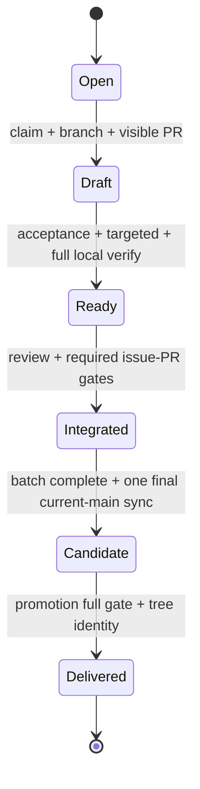
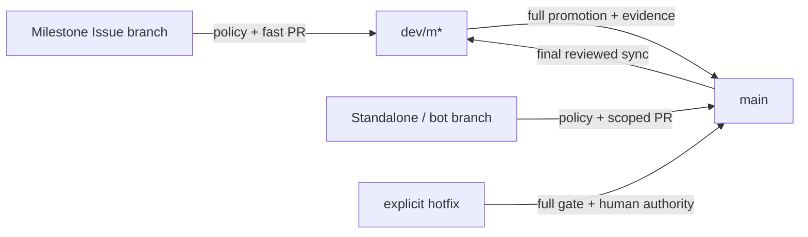

# Low-friction AI SDLC ADR

- **狀態：**Proposed
- **日期：**2026-08-25
- **來源 Issues：**[#264](https://github.com/Innoguard-Cyber-Arch/csarc-repo-template/issues/264), [#317](https://github.com/Innoguard-Cyber-Arch/csarc-repo-template/issues/317), [#320](https://github.com/Innoguard-Cyber-Arch/csarc-repo-template/issues/320)
- **實作 PRs：**[#186](https://github.com/Innoguard-Cyber-Arch/csarc-repo-template/pull/186), [#190](https://github.com/Innoguard-Cyber-Arch/csarc-repo-template/pull/190), [#191](https://github.com/Innoguard-Cyber-Arch/csarc-repo-template/pull/191), [#193](https://github.com/Innoguard-Cyber-Arch/csarc-repo-template/pull/193), [#216](https://github.com/Innoguard-Cyber-Arch/csarc-repo-template/pull/216), [#220](https://github.com/Innoguard-Cyber-Arch/csarc-repo-template/pull/220), [#280](https://github.com/Innoguard-Cyber-Arch/csarc-repo-template/pull/280)
- **政策草案：**[`../low-friction-ai-sdlc-policy.md`](../low-friction-ai-sdlc-policy.md)

本 ADR 是供審查的目標模型，不代表 workflow 或既有政策已改變。在後續 Issues 完成
實作、回歸測試與 root／template 同步前，`AGENTS.md` 與
[`docs/ci-policy.md`](../ci-policy.md) 仍是現行操作契約。

## 問題與限制

Milestone #7 把 Issue work、delivery integration、promotion 與 release 分開，守住完整
驗證、candidate tree identity、canary 三態與 provenance。但日常路徑同時暴露 branch
選擇、Draft／Ready、main sync、Actions quota fallback、promotion evidence 與 cleanup；
每一步單獨合理，組合後卻讓團隊使用者與 agent 必須在多份文件間重建狀態機。

本提案不能用外部專案的慣例覆蓋以下 repo-specific 限制：

- private-plan 能力可能無法 server-side 強制，`allowed`、`blocked`、`unknown` 必須分開。
- 多個 agent 的 worktree 彼此隔離檔案，卻共用 GitHub PR、destination branch 與 credential。
- dependency、workflow、security、release 與 provenance 仍是供應鏈邊界。
- `main` 是發布來源；delivery branch 是整合候選，不是另一個可獨立發布的真相來源。
- #189 的 hosted runner-minute 尚未實測；本機結果或 quota fallback 不算 live evidence。

## 研究方法與可重現性

觀察日期均為 **2026-08-25（Asia/Taipei）**。三個專案都未 archived，當日仍有 push；
stars 只用來說明規模，不當作品質或因果證據。專案檔案使用觀察當下的 commit permalink，
避免 default branch 後續變更使比較失真。

可用以下命令重查活動狀態、commit 與原始檔；把 `<owner/repo>`、`<sha>`、`<path>`
替換為表中的值：

```bash
gh api repos/<owner/repo> \
  --jq '{default_branch,archived,stargazers_count,pushed_at}'
gh api repos/<owner/repo>/commits/HEAD \
  --jq '{sha:.sha,date:.commit.committer.date}'
gh api 'repos/<owner/repo>/contents/<path>?ref=<sha>' \
  --jq .content | base64 --decode
curl -fsSL '<engineering-practice-url>'
```

### 活躍主流開源專案

| 專案快照 | Branching、merge／review 與 release | CI 與測試觀察 | 採用與限制 |
| --- | --- | --- | --- |
| [Home Assistant core @ `9168a69`](https://github.com/home-assistant/core/tree/9168a6944379a45d9d1dbe6861bd8a4728106bf2)，約 90,099 stars，default `dev` | [CONTRIBUTING](https://github.com/home-assistant/core/blob/9168a6944379a45d9d1dbe6861bd8a4728106bf2/CONTRIBUTING.md#L5-L13) 要求先確認 tests，再把 PR 送到 `dev`；CI 對 `dev`、`rc`、`master` push 執行，顯示整合與 release branch 有邊界。 | [CI](https://github.com/home-assistant/core/blob/9168a6944379a45d9d1dbe6861bd8a4728106bf2/.github/workflows/ci.yaml#L76-L216) 先找 core／integration changes；局部 integration PR 縮成單組 tests，core、整合 branch、label 或手動要求才跑 full suite。 | **調整採用** change-aware tests 與整合邊界。其 [AI policy](https://github.com/home-assistant/core/blob/9168a6944379a45d9d1dbe6861bd8a4728106bf2/CONTRIBUTING.md#L23-L28) 不接受 autonomous agents，且文件沒有 Draft ownership 契約，不能直接套用本 repo 的 agent 模式。 |
| [Next.js @ `1780fa0`](https://github.com/vercel/next.js/tree/1780fa03750fe96816e90f85ad51f68cd5974f70)，約 141,922 stars，default `canary` | [CONTRIBUTING](https://github.com/vercel/next.js/blob/1780fa03750fe96816e90f85ad51f68cd5974f70/contributing.md#L4-L14) 要先搜尋既有工作，且每張 PR 仍由 maintainer review；[release workflow](https://github.com/vercel/next.js/blob/1780fa03750fe96816e90f85ad51f68cd5974f70/.github/workflows/create_release_branch.yml#L1-L24) 以人工 dispatch 從指定 tag 建 branch。 | [build-and-test](https://github.com/vercel/next.js/blob/1780fa03750fe96816e90f85ad51f68cd5974f70/.github/workflows/build_and_test.yml#L28-L82) 先分類 docs-only、release 與 bundler scope，再讓大量 jobs 依 outputs 決定是否執行；最後仍有 [aggregate job](https://github.com/vercel/next.js/blob/1780fa03750fe96816e90f85ad51f68cd5974f70/.github/workflows/build_and_test.yml#L1229-L1238)。 | **調整採用** scope classifier、maintainer review 與穩定 aggregate。release branch 使用具 write 權限 GitHub App，不符合本 repo 的 portable no-App baseline，不採用該 credential 模式。 |
| [Rust @ `9bb55c8`](https://github.com/rust-lang/rust/tree/9bb55c8c865411b7d9dea6ff743e583d510d89f5)，約 116,155 stars，default `main` | Primary workflow 把一般 PR、`bors try`、`bors auto` 分開；`auto` 是進 default branch 前的整合 gate。貢獻文件把 compiler、標準庫與 LLM review 分流到專門指南。 | [CI entry](https://github.com/rust-lang/rust/blob/9bb55c8c865411b7d9dea6ff743e583d510d89f5/.github/workflows/ci.yml#L1-L100) 動態計算 matrix；[jobs](https://github.com/rust-lang/rust/blob/9bb55c8c865411b7d9dea6ff743e583d510d89f5/src/ci/github-actions/jobs.yml#L101-L204) 明確分 PR、try、optional 與 merge 前必須 green 的 auto jobs。 | **調整採用** 將快速回饋、選配驗證與整合 gate 分開。bors、專用 runner、S3 與大型基礎設施不是可攜式 baseline；也沒有可直接移植的 Draft ownership 規則。 |

### 可信工程實務來源

| 來源 | 可重現觀察 | 本 repo 的取捨 | 適用限制 |
| --- | --- | --- | --- |
| [GitHub Draft PR](https://github.com/github/docs/blob/b07cfbc4e1740b2d79b7b90761499df691d68d32/content/pull-requests/reference/pull-requests.md#L42-L50) | Draft 可分享 work-in-progress、不能 merge，且不會自動要求 code owner review。 | 採用 Draft 作「可見 ownership」，Ready 才代表可正式審查；Draft 本身不是 approval 或 merge authorization。 | 平台不會替 repo 驗證 scope、驗證清單或 agent identity，仍需 #240 的互斥控制。 |
| [GitHub protected branches](https://github.com/github/docs/blob/b07cfbc4e1740b2d79b7b90761499df691d68d32/content/repositories/configuring-branches-and-merges-in-your-repository/managing-protected-branches/about-protected-branches.md#L93-L109) 與 [workflow skip](https://github.com/github/docs/blob/b07cfbc4e1740b2d79b7b90761499df691d68d32/data/reusables/actions/workflows/triggering-a-workflow-paths2.md) | Required checks 必須成功／skipped／neutral；strict 模式要求 head 跟上 base。整個 workflow 被 branch／path filter 略過時，required check 會停在 Pending。 | 保留 stable aggregate；promotion 要 current-main，Issue PR 用低成本 route check。 | Private-plan 能力受方案限制；declarative rule 不等於已 enforce，unknown 必須 fail closed。 |
| [DORA trunk-based development](https://dora.dev/capabilities/trunk-based-development/) | 建議小批次、每日整合、三條以下 active branches、快速 tests；也把過重 review 與長等待列為阻礙。 | 採用短 issue branch、少選項與快速回饋；delivery branch 僅作明確期限的整合候選。 | DORA 是跨組織研究與實務建議，不是本 repo 的 branch 數硬性門檻；多 Milestone 隔離與 release evidence 仍有本地理由。 |
| [Martin Fowler: Continuous Integration](https://martinfowler.com/articles/continuousIntegration.html) | 單一 mainline、頻繁整合、每次 mainline 更新觸發 build，且 build 要快；整合前先更新並重跑驗證。 | 採用「先同步再交付」與 fast feedback；`main` 保留 release boundary，`dev/*` 是暫時 integration line。 | 文章假設團隊能持續整合到 mainline；本 repo 的 quota、private-plan 與批次 release 使直接 main-only 不安全。 |
| [Martin Fowler: Test-Driven Development](https://martinfowler.com/bliki/TestDrivenDevelopment.html) | Red → Green → Refactor：先寫下一個行為的失敗測試，只寫足以通過的程式，再整理。 | 要求每個非 trivial 行為留下最窄可觀察 regression；不保存每個暫態 commit，也不為文字實作細節造測試。 | TDD 是回饋迴圈，不會替代 security、compatibility、integration 或 release evidence。 |
| [Google Testing Blog: test pyramid](https://testing.googleblog.com/2015/04/just-say-no-to-more-end-to-end-tests.html) | 多數為快速、可靠、能定位失敗的 unit tests；較少 integration，最少 E2E。70/20/10 只是 first guess，比例應依團隊調整。 | 採風險形狀而非固定比例：行為 unit 多、跨元件 contract 少、promotion E2E 最少但不可省。 | 2015 年文章以一般產品測試為主；供應鏈、GitHub capability 與 provenance 仍需專門 checks。 |

比較不顯示「主流專案都使用同一 branch」。它顯示的共同點是：把 work 做小、讓預設
回饋快、把昂貴或具權限的驗證放到明確邊界，並保留一個不可模糊的 merge gate。

## 現況流程與摩擦盤點

下表依 `AGENTS.md`、現行 `docs/ci-policy.md`、已合併 PR 與 live Issues 重建從選 Issue
到 `main` 的完整路徑。它是決策點盤點，不是工時量測。

| 現況狀態 | 人工動作與等待 | 驗證 | 失敗恢復與摩擦 |
| --- | --- | --- | --- |
| 選 Issue | 清理 dry-run、限量搜尋歷史、讀 Issue／PR／ADR、判定 Milestone 或 standalone | Issue scope、label、Milestone、既有 branch／worktree／PR | 資訊散在多處；找不到 route 時應停止，不能猜。 |
| 建 branch／worktree | Milestone 從 `dev/m*` 建 `type/*`；standalone、hotfix、bot 從 `main` 建短分支 | parent branch、乾淨 worktree、單一 Issue scope | route 只由 Milestone 與工作類型決定，不再選永久中間 trunk。 |
| 實作中 | TDD、targeted checks、更新文件／root-template pair | 最窄 regression、lint/type/test | #261 已讓 targeted checks 後即可開 Draft；尚未自動化的摩擦是使用者仍要自行組合 route、risk 與下一步。 |
| 開 PR／Draft／Ready | targeted 後開 Draft 揭露 owner／scope／依賴，Ready 前完成 acceptance 與 full verify | closing keyword、`verify-template.sh`、head SHA | #261 已移除開 Draft 前的 full gate；狀態仍分散在 Issue、PR、checks 與 branch，沒有單一 status 入口。 |
| Issue PR checks | 等 policy、fast、stable `verify`；高風險路徑升 full | route、title、Issue linkage、secret、targeted tests、條件式 security | #201 已把一般路徑收斂為最多三個 runner jobs；unknown 仍應 full，而不是猜低風險。 |
| Actions quota fallback | Routine 以 canonical tool 確認完整 zero-step run set、重跑 full 並留單一 note；promotion 才使用 attestation 與 human authorization | exact head、commands、未重現 checks | #254 已移除 routine PR 的逐張 human 等待；promotion 仍合理需要雙重授權。 |
| Merge 到 delivery | review／授權後合併；非 default base 可能需手動關 Issue | live PR head/base、無 blocker、checks | #240：worktree 不隔離 GitHub；#236/#237 發生 Ready／Draft／merge race，#253 顯示 `baseRefOid` 不是 live destination CAS。 |
| 等待 Milestone | Milestone 等其他 Issues 與 promotion Issue；standalone 直接進 main | acceptance、所有非 promotion Issues 完成 | 等待只存在於需要共同驗收的 Milestone。 |
| `main → dev/m*` sync | ordinary work 不追逐 main；各 Milestone 到 final promotion 才由 owner 開一張 reviewed sync PR | final candidate 必須包含當時 current `main` | stale preflight 只建立該 Milestone 的一個 action；明列 dependency 的 PR owner 才能提前 sync。 |
| Promotion | 建 PR、pin base/head/tree、等 full matrix、canary／artifact、review；quota 時再做完整雙留言流程 | `verify`、promotion gate、candidate tree、Milestone、canary 三態 | 安全必要但接觸點多；任何 base drift 都使舊 evidence 失效。 |
| 進 `main` 後 | 核對 tree identity、release-source、Issue／Milestone lifecycle、cleanup | main tree 必須等於 candidate；release 只接受 hosted evidence | 失配要停 release 並另開修正；Milestone delivery 與 bridge 完成後刪除。 |

### Live friction evidence

| 證據 | 已觀察摩擦 | 對本提案的要求 |
| --- | --- | --- |
| [#238](https://github.com/Innoguard-Cyber-Arch/csarc-repo-template/issues/238)／[#320](https://github.com/Innoguard-Cyber-Arch/csarc-repo-template/issues/320) | 長期整合 branch 曾在 promotion 後被平台 auto-delete，促成 repository-wide temporary setting mutation 與 recovery machinery。 | 改以 `main` 為唯一永久 branch，Milestone delivery 一律短命；事故成因因此消失，不再修改全域 auto-delete 設定。 |
| [#240](https://github.com/Innoguard-Cyber-Arch/csarc-repo-template/issues/240)／[PR #260](https://github.com/Innoguard-Cyber-Arch/csarc-repo-template/pull/260) | #236 的 merge call 比另一 task 轉 Draft 早約 1.7 秒；#253 又證明只比 source head 不能防 destination base race。 | 所有 PR lifecycle writes 以跨 process lease 序列化，merge 前重讀 live source、destination、Draft、blocker 與 authorization。 |
| [#254](https://github.com/Innoguard-Cyber-Arch/csarc-repo-template/issues/254) | Teams private plan 的 quota block 是日常條件；#254 已讓 routine PR 以 exact-head canonical note 配合 Alpha self-merge，不再逐張等第二則 human authorization。 | 保留已生效的 single-note routine fallback；#240 日後只補 writer 互斥，promotion 仍不簡化。 |
| [#261](https://github.com/Innoguard-Cyber-Arch/csarc-repo-template/issues/261) | #261 已允許 targeted checks 後先開 Draft，讓遠端可見 owner、scope、依賴與待完成驗證。 | 保留現行 early Draft ownership；Ready 前才完成 acceptance 與完整驗證。 |

## 決定

### 設計原則

1. **預設只有一條路。** Issue 有 Milestone 就由工具導向其短命 `dev/m*`；否則由短分支
   直接導向 `main`。Hotfix 與 risk escalation 只由明確條件開啟。
2. **Draft 是 ownership，不是品質聲明。** 先暴露 work、scope 與依賴；Ready 才承諾
   acceptance、完整驗證與可審查性。
3. **TDD 驗證行為，不驗證文字排列。** 非 trivial 變更先留下會失敗的最窄 behavior
   check，再完成實作與 refactor；security 與資料損失邊界不因「最小」被省略。
4. **檢查成本跟著風險與 delivery stage。** Routine PR 先 policy／fast；未知或高風險
   升 full；promotion／hotfix 永遠 full。Scheduled drift 不阻塞每次 commit。
5. **一份 evidence 只證明一個 immutable candidate。** head、live destination、tree 或
   blocker 改變就失效，不把舊成功搬到新內容。
6. **自動化只能拿掉等待，不能拿掉 authority。** 無法證明 single writer、權限或
   evidence 時 fail closed；不把 shared credential 當獨立 reviewer。
7. **發布邊界不降級。** `main`、release、provenance、external canary 的既有安全契約
   保留；artifact-only 仍誠實標示限制。
8. **同步只在需要時發生。** `main` movement 不使 ordinary delivery PR 失效；hotfix、
   standalone 與 bot 結果等每個 Milestone final promotion 才回流。只有 live PR owner 明列
   dependency 時可以提前同步，而且一次只處理一條 delivery。

### 最小 state model

狀態只描述可交付性，不把每個 workflow job 變成一個人工狀態。`BLOCKED` 是任何轉移
的 guard 結果；修復後回到最後一個仍有效的 durable state，不跳關。



| State | 唯一必要事實 | 可執行者 | 不能推論 |
| --- | --- | --- | --- |
| `Open` | Issue 尚未有有效 owner／Draft | 團隊使用者或 agent 可認領 | branch 存在不等於已認領，仍要查 PR／worktree。 |
| `Draft` | 一張對正確 base 的 Draft 公開 scope、owner、依賴與待辦 | Issue owner 可更新；其他人 review-only | 不可 merge、不可用 closing keyword 宣稱完成、不可視為已通過 full verify。 |
| `Ready` | acceptance 完成、targeted 與完整本機驗證通過、無較新的 blocker | Issue owner可請 review；reviewer 決定 approval | Ready 不等於有 merge authority，且新 commit／base drift 會退回待驗證。 |
| `Integrated` | exact Issue candidate 已受審查合併到正確 delivery branch | lease holder 或 human maintainer | 非 default base 的 closing keyword 不保證 Issue 已關；必要時由 lifecycle 補正。 |
| `Candidate` | delivery scope 完成、包含 current `main`，promotion evidence 綁定 live base/head/tree | delivery owner 建立；human／platform核准例外 | artifact-only 不等於 external canary，local fallback 不等於 release evidence。 |
| `Delivered` | verified candidate 已進 `main` 且 post-merge tree identity 成立 | human 或受保護 automation | merge timestamp 本身不證明 release／provenance 成功。 |



- `Issue → dev/m*`：只承載同一 Milestone 的可審查變更；route 由 Issue metadata 推導。
- `main → dev/m*`：只在 final promotion 做一次 reviewed sync；明列 dependency 才可提前，
  不直接 push、不 fan-out、不讓一條 delivery merge 另一條。
- `dev/m* → main`：只有 promotion；在 immutable candidate 上付完整驗證與發布證據成本。
- `Issue → main`：standalone 與 bot 維持短 branch，通過 scoped／risk gate 後直接合併。
- `hotfix → main`：只處理正式環境緊急缺陷；不立即回同步所有 active delivery，各自於
  final promotion 納入。

### 風險與 authority

| 類別 | 判定 | 必要 gate | 例外授權 |
| --- | --- | --- | --- |
| Routine Issue | docs、局部行為或已知低風險路徑，route classifier 能完整解釋 | targeted behavior checks、policy、fast、stable aggregate；Ready 前一次完整本機驗證 | 現行 #254 已允許 zero-step quota 的 canonical note／Alpha self-merge；#240 日後只增加 writer serialization。 |
| Elevated Issue | workflow、權限、security、dependency／lock、governance、release、跨 profile 或 unknown path | full tier、獨立 human review、exact source/destination 再確認 | 只有 human maintainer 可接受風險或改分類；不能用 quota note 自動降級。 |
| Promotion／hotfix | 任何進 `main` 的 delivery candidate 或正式環境緊急修正 | current-main、full、candidate tree、review、canary 三態、post-merge identity | quota fallback 仍需 human attestation／authorization；release-only controls 不可本機取代。 |
| Periodic／release | drift、OSV、Zizmor、artifact、SBOM、provenance | 排程或 verified main source；idempotent evidence | 不阻塞 routine PR，但失敗會阻止受影響 promotion／release。 |

| 角色 | 可以授權 | 不可以授權 |
| --- | --- | --- |
| Issue owner／agent | 認領、Draft 更新、完成驗證後標 Ready | 自己消除 blocker、把 unknown 降成 routine、把 Draft 當 merge authorization。 |
| Reviewer | 對內容提出／解除 review blocker | 代表 billing owner、release owner 或另一個 credential 身分。 |
| Delivery owner | 在 final promotion sync、判定 batch scope、建立 promotion candidate；有明列 dependency 時提前同步自己的 delivery | 改寫 history、批次同步其他 Milestone、跳過 current-main 或挪用另一 candidate 的 evidence。 |
| Human maintainer | hotfix、risk downgrade、quota promotion、degraded capability 下的 merge | 把失敗或未執行的 check 宣稱成功。 |
| Automation lease holder | 在 policy 明確允許且 live state 未漂移時執行單次 metadata／merge mutation | 在 lease、source、destination、Draft、blocker、authorization 任一 unknown 時寫入。 |

以下任一狀況一律 fail closed：route／risk 不明、必要 branch 缺少、lease 無法取得、
source 或 live destination 漂移、新 Draft／blocking review／未完成 checklist、required check
未成功且不符合精確 fallback、candidate tree 不符、allowed canary 未成功、release evidence
不符。Canary `blocked`／`unknown` 只能維持 artifact-only，不能宣稱 external canary 成功。

### 既有決策 disposition

| Issue | 結論 | 理由 |
| --- | --- | --- |
| [#179](https://github.com/Innoguard-Cyber-Arch/csarc-repo-template/issues/179)／[PR #186](https://github.com/Innoguard-Cyber-Arch/csarc-repo-template/pull/186) | **取代** | #320 收斂為 main-only permanent trunk：Milestone 保留短命 delivery，standalone／hotfix／bot 直接 main，風險由 gate 而非額外 branch 表達。 |
| [#181](https://github.com/Innoguard-Cyber-Arch/csarc-repo-template/issues/181)／[PR #190](https://github.com/Innoguard-Cyber-Arch/csarc-repo-template/pull/190) | **保留** | 四層 CI 與 stable aggregate 已符合外部 change-aware 實務；只把 tier 選擇自動化，不刪 secret、security 或 unknown→full。 |
| [#182](https://github.com/Innoguard-Cyber-Arch/csarc-repo-template/issues/182)／[PR #191](https://github.com/Innoguard-Cyber-Arch/csarc-repo-template/pull/191) | **保留** | current-main、full gate、candidate tree、canary 三態與 post-merge identity 是 release boundary，不是一般 PR 儀式。 |
| [#184](https://github.com/Innoguard-Cyber-Arch/csarc-repo-template/issues/184)／[PR #193](https://github.com/Innoguard-Cyber-Arch/csarc-repo-template/pull/193) | **簡化** | 詳細 runbook 留作例外參考；預設入口改成一條 happy path、風險表與六個 states，不要求使用者先讀完所有分支。 |
| [#201](https://github.com/Innoguard-Cyber-Arch/csarc-repo-template/issues/201)／[PR #216](https://github.com/Innoguard-Cyber-Arch/csarc-repo-template/pull/216) | **保留** | 合併 runner 而不移除 gate，正是低摩擦方向；不因新增本政策再創一個 runner。 |
| [#202](https://github.com/Innoguard-Cyber-Arch/csarc-repo-template/issues/202)／[PR #220](https://github.com/Innoguard-Cyber-Arch/csarc-repo-template/pull/220) | **保留** | runtime-independent 工作只跑一次，compatibility matrix 只驗 runtime-sensitive 行為；這是去重，不是降低 coverage。 |

沒有一項因「主流專案這樣做」而直接反轉。差異均由 private-plan capability、多 agent
control plane、供應鏈與 promotion／release boundary 解釋。

## 評估過的替代方案

| 方案 | 結論 |
| --- | --- |
| 所有工作直接 main／純 trunk-based | 不採用；會把 release、provenance 與多 agent destination race 混回每張 Issue。 |
| 所有 PR 一律 full matrix | 不採用；#181、#201、#202 已證明能以風險與邊界保留同等必要 evidence。 |
| 只靠 Draft 避免重複工作 | 不採用；Draft 提供可見性但沒有跨 process CAS，也不能防較新的 blocker 被另一 task 覆寫。 |
| Routine 與 promotion 共用自動 quota merge | 不採用；promotion 是 release boundary，仍需 human authority 與完整 SHA/tree evidence。 |
| 用固定 70/20/10 當測試門檻 | 不採用；Google 明確把比例稱為 first guess，本 repo 以可觀察行為與風險分層。 |

## 重新評估條件

本 ADR 維持 `Proposed`。已落地的 #254 routine quota、#261 early Draft ownership 與 #265
behavior-oriented tests 是現行基線，必須持續保留；#240 single-writer／live destination
guard 與 #266 path automation 進入本 delivery branch，每張實作 Issue 各自完成 root／
template、targeted regression 與 `./scripts/verify-template.sh`，並經維護者審查後，才能把
本提案改為 `Accepted`。本 PR 不預先修改 workflow，也不把 future automation 宣稱為 active。

Milestone #9 應以政策草案的 scenarios 執行 fixture／live dry-run，記錄人工接觸點、等待、
checks 與復原。#189 的 hosted runner-minute 仍獨立驗收。若實測顯示 routine latency 未降、
unknown routing 增加、lease 誤阻擋或 promotion evidence 減弱，另開 Issue 調整；不在本
ADR 內靜默放寬 fail-closed 邊界。
