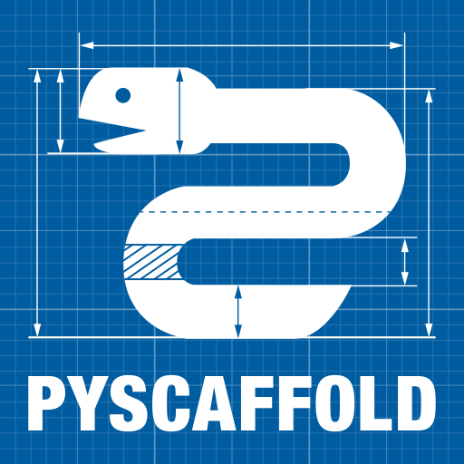

+++
title = "CSARC Repo Template | AI-assisted SDLC foundation"

[controls]
language = "Reading language"
detail = "Reading mode"
simple = "Standard"
technical = "Maintenance"
slides = "Presentation controls"
previous = "Previous slide"
next = "Next slide"
zoom = "Display zoom controls"
zoom_out = "Zoom out"
zoom_reset = "Fit to screen"
zoom_in = "Zoom in"
fit = "Fit"
+++


The template puts work definition, AI instructions, verification, merging, dependencies, and delivery evidence into one reviewable flow.

| Choice | Production capability available today |
| --- | --- |
| Project composition | CI/CD-only, Python 3.14, TypeScript with Node 24 and pnpm 11, or Python plus TypeScript |
| Branch strategy | Milestone delivery branches, `main`-only, or one long-lived `dev` |
| Shared baseline | SDD Features with Task/Bug subissues, dated delivery Milestones, tiered CI, promotion evidence, security checks, one SemVer, and Copier updates |


- **New repository:** choose a profile and branch strategy; keep the story in an SDD Feature, deliver Task/Bug subissues through separate PRs, and use a Milestone only for dated delivery.
- **Existing repository:** preview adoption on a branch, preserve product content and legacy-debt boundaries, then resolve conflicts and gates explicitly.
- **Repository already using the template:** update from a reviewed template SHA and review only that revision's diff.
- **Prerequisites:** Git, GitHub CLI, and uv; TypeScript or mixed projects also need Node 24+ and pnpm 11. Local verification needs no token.

The template claims only capabilities backed by executable files and regression checks. Go, Rust, generic deployment, monitoring, RAG, and hosted documentation remain future or optional work.




| What you are doing | How the template guides you |
| --- | --- |
| Create the work | The Issue form prompts for the problem, completion conditions, and necessary context |
| Make the change | Repository guidance tells people and agents how to work and which local check to run first |
| Open a PR | The PR template prompts for the linked Issue, completed result, and verification evidence |
| Read the result | The template selects the necessary checks and identifies what must be fixed |
| Review and merge | Merge into the correct branch after the result and human review are clear |

Users do not need to memorize workflow or script names. Current automation focuses on work items, PR rules, and necessary verification; automated versioning and publishing are not enabled yet.


- **07 Governance:** consistent permissions, branch, review, and merge rules.
- **08 Template updates:** Copier carries policy changes back through reviewable PRs.
- **09 Internal site:** keeps practices, limits, evidence, and decisions discoverable.
- **10 Adoption levels:** start with the baseline and add platform capability only after conditions are met.

A failed check is fixed in the same PR. A new problem found after merge becomes a separate, bounded Issue.




| Path | Purpose | Responsibility |
| --- | --- | --- |
| `.copier-answers.yml`, `.csarc/profile.json` | Template source, profile, and branch strategy | Template-led |
| `.github/ISSUE_TEMPLATE/`, `pull_request_template.md` | Work definition and PR contract | Template-led |
| `.github/workflows/` | Five active flows: Issue triage, Milestone sync, spec sync, PR rules, and necessary verification | Template-led |
| `AGENTS.md`, `README.md`, `CLAUDE.md` | Agent working rules and user entry point | Shared |
| `policies/`, `CODEOWNERS`, `.github/REVIEWERS` | Desired settings, owners, and reviewers | Shared |
| `scripts/` | Local verification, work synchronization, and repository settings | Template-led |
| `docs/`, `site/` | Project guidance, specifications, decisions, and internal site | Shared |
| `src/`, product tests, and product specifications | Product behavior | Project-owned |


Copier carries updates into a short branch and leaves conflicts in the PR for human review. Fixtures cover new project generation, existing-repository adoption, and a later update of the same repository. They add product-owned files and prove that an update does not overwrite them.

Workflows, policies, scripts, and documents shared by root and `template/` are kept in sync. Files that differ because of project choices are verified by generating a real project. Version and publishing configuration remains present, but its GitHub Actions are not enabled yet.




### Our choice

- **Overall:** define the work in an Issue, implement it on a branch, then review and deliver it through a PR.
- **Milestone:** create one only when multiple work items share a deadline, integration point, or release.
- **Issue:** choose the Feature, Task, Bug, or Documentation form, then state the problem, acceptance criteria, and verification.
  - Feature is an outcome that needs several pieces of work.
  - Task is work that can be completed and verified independently.
  - Bug is a result that differs from expectations.
  - Documentation changes only documentation or examples.
  - Use a clear English title; the creator owns the Issue by default.
  - Keep work together when one PR and one result can verify it. Create a Sub-issue when work can be independently implemented and verified, or when required follow-up exceeds the original scope.
  - A Parent describes the shared outcome that is not complete yet; all required Sub-issues must finish before it closes. Dependency expresses ordering instead.
- **PR:** explain what was completed, link the Issue it closes, and deliver it after the checks pass; the creator owns it by default.
- **Exceptions:** close repeated work as Duplicate. Hotfix marks an urgent fix, but still requires an Issue, verification, and review.

### Other common approaches

- **Start first, document when needed:** finish small, clear work directly; add a plan only for work that spans sessions, has dependencies, or carries higher risk.
- **Specification first:** clarify requirements, design, and task breakdown before development begins.
- **Change proposal:** review a proposed change separately, then merge it into the official specification after acceptance.
- **Complexity-based workflow:** use a short path for small work and add discovery, design, roles, and review only for larger work.

Concrete tools, feature names, and source links are listed under [Similar tools](#similar-tools).

<aside class="config-guidance"><strong>Specification format</strong>
Keep the current lightweight Issue and spec format. Reconsider a separate Spec Kit workflow only when approved requirements routinely need a full spec, plan, and task breakdown.
</aside>




**Baseline.** An Issue bounds the work, `AGENTS.md` explains how to work, and code plus tests provide evidence. People retain product direction and material-risk decisions.

- **Work and context:** GitHub Issues and PRs record scope, progress, and evidence. Approved specs and ADRs retain long-lived decisions; add a plan only for cross-session, high-risk, or hard-to-recover work, and never save chat transcripts.
- **AI rules:** the root `AGENTS.md` is the single source; `CLAUDE.md` is a thin import, and a child file exists only for a genuine scoped difference.
- **Change isolation:** each writable task uses its own branch and worktree. Parallelize only independent scopes; read-only work needs no extra worktree.
- **Verification evidence:** run the smallest relevant local program. Actions provide events and permissions and call the same program instead of copying logic.
- **Decisions and authorization:** people own requirements, material trade-offs, external impact, and irreversible operations. Rules governance defines review, merge eligibility, and exceptions.
- **Template creation and updates:** Copier generates and updates the shared baseline; the Template upgrades section defines existing-repository updates.

`README.md` serves people, `AGENTS.md` serves every agent, and `template/AGENTS.md.jinja` plus `copier.yml` emit only commands the selected profile can run. `scripts/cleanup-worktrees` and `scripts/test-worktree-cleanup` handle safe cleanup; `scripts/verify`, `.github/workflows/`, and `policies/` keep rules, evidence, automation, and governance separate.

Concrete tools and sources are in [Similar tools](#similar-tools); Journey 02 local checks and Actions are in [CI/CD settings](#testing).



- **During development:** run only the focused check that proves the current change, using fresh output before claiming completion.
- **Issue PR (work branch → dev):** the system selects the appropriate checks from the change; when unsure, it runs full verification.
- **High-risk boundaries:** promotions, hotfixes, release recovery, merge queues, and manual runs use full.
- **One implementation:** GitHub Actions has one `verify` job with a 30-minute timeout and only calls repository scripts.
- **Repository scope:** a normal repository checks its own changes; the template repository also confirms that newly generated repositories work.

Verification logic lives only in scripts and tests. This step restores only `.github/workflows/ci.yml`; release, promotion, security scanning, remote governance, deployment, and scheduled workflows remain decisions for their own Journeys. See [Similar tools](#similar-tools) for concrete comparisons and [CI/CD settings](#testing) for execution locations.



| Work type | PR base | Route into `main` |
| --- | --- | --- |
| Milestone Issue | `dev/m<Milestone>-*` | Milestone promotion PR |
| Ordinary standalone Issue | `dev/next` | Batched promotion in the release window |
| Issue requiring isolated soak or canary | Temporary `dev/i<Issue>-*` | That Issue's promotion PR |
| Emergency correction | `main` | Only a standalone `fix/*` PR labeled `hotfix` |


- Work branches use `type/<Issue>-short-slug`, and the PR links the matching open Issue.
- When `main` advances, each active delivery owner integrates it through a reviewed `sync/main-to-*` PR without direct pushes or history rewrites.
- `feat`, `fix`, and `!` determine SemVer only after merge from actual default-branch history; open PRs never reserve versions.
- `pr-policy.yml`, `delivery-sync.yml`, and `promotion.yml` verify route, Issue, title, synchronization, and promotion evidence.




| Problem | Current control | What it does not prove |
| --- | --- | --- |
| Brand-new package version | Dependabot and pnpm wait three days for ordinary releases | The package has no disclosed vulnerability |
| Disclosed vulnerability | OSV scans and alerts immediately | Downloaded content is identical |
| Content integrity | `uv.lock` SHA-256, pnpm integrity, release checksum | The publisher is trustworthy |
| Artifact composition | CycloneDX SBOM generated from the unpacked artifact | The SBOM blocks vulnerabilities by itself |


Dependabot keeps GitHub's native automation identity, so its PRs trigger existing policy and change-aware checks without a privileged App or long-lived PAT in every repository. pnpm `minimumReleaseAge` protects local and CI resolution, while `trustPolicy: no-downgrade` rejects publisher-trust downgrades.



- Update delay: `.github/dependabot.yml` and `pnpm-workspace.yaml`.
- Frozen installation and lockfile integrity: `scripts/verify`.
- Vulnerability and release evidence: `osv.yml`, `release.yml`, and `SECURITY.md`.

Renovate offers a more flexible shared preset, but a self-hosted token cannot trigger every required check normally, while the Mend App asks for organization-member read, repository-administration read, and workflow/content/PR write. Dependabot remains the default until a real fleet policy cannot be expressed without Renovate.




| Preconditions | Mode | Behavior and guarantee |
| --- | --- | --- |
| Valid source; PR, contents, Release, and dispatch are all `allowed` | Release PR | Reviewable version and changelog; merge dispatches artifacts with the source run ID |
| Valid source; PR is `blocked/unknown`; all other writes are `allowed` | Direct | Tag only the latest versioned `main` with a CHANGELOG; out-of-order runs no-op |
| Invalid source or any delivery write is not `allowed` | Verification only | Preserve machine-readable evidence and create or claim no Release |


The release source verifies full `verify`, canary state, included PRs, and main tree identity. Every profile shares one template SemVer: `fix(scope)` raises patch, `feat(scope)` raises minor, and `!` raises major. Incompatibility with any supported profile is a breaking change to the template.



Direct mode rereads the default-branch head before writing and delivers only when the latest `main`, source, tag, CHANGELOG, and promotion evidence agree; workflow concurrency is not treated as FIFO. The artifact workflow accepts only a release-source run ID, creates a digest, SBOM, and attestation, ignores arbitrary tag pushes, and does not repeat full CI.

GitHub Release is the baseline for every profile. PyPI and npm are separate opt-ins that default off and use a GitHub environment plus short-lived OIDC credentials, never stored registry tokens. `scripts/release_policy.py` detects capabilities and configures versions; `scripts/promotion_gate.py` validates promotion.




| GitHub state | `apply` result | Actual gate |
| --- | --- | --- |
| Free + public | Apply a Ruleset through REST | Missing or mismatched rules fail |
| Free organization + private | Apply baseline settings and retain desired Ruleset in `policies/rulesets.json` | Request one individual reviewer and report `DEGRADED`; no merge gate |
| Pro personal + private | Apply a Ruleset | Same as Free public |
| Team/Enterprise organization + private | Verify the CODEOWNERS team, then apply a Ruleset | Review, CODEOWNER, and status checks become merge gates |


Run `scripts/apply-repository-settings.sh plan`, `apply`, then `check`. The check compares CODEOWNERS, repository settings, Actions, policy labels, and effective Rulesets. `.github/workflows/governance-drift.yml` reruns daily and opens or updates a tracking Issue for repairable drift.

Scheduled checks are snapshots. A setting changed and restored between runs still requires the GitHub audit log or organization monitoring. Complete administration fields should be checked from a trusted checkout with Administration read credentials, never by exposing that token to PR code.




- `template/` is the delivered source; root retains the template repository's own GitHub governance and dogfood configuration.
- CI/CD-only, Python, TypeScript, mixed, and minimum-Python compositions are generated and verified.
- An existing repository is adopted and then updated from the next Copier revision, proving product content is preserved.


[Copier](https://github.com/copier-org/copier) records source, language, and answers, then reapplies newer template revisions to an editable repository. Conflicts remain in a short branch and PR for human review. GitHub Template copies only once, while PyScaffold would create a second update mechanism, so neither fits this requirement.



`scripts/sync-paired-files.sh` makes root the source of paired files and verifies copied content and permissions with `--check`. `profiles/catalog.yaml` records runtime baselines and real pilot status. Python and Node baselines advance only after their own thirty-day observation period.

`scripts/verify-template.sh` runs create/adopt/update fixtures only in the template repository and is never delivered downstream. Generated repositories use the smaller `scripts/verify` entry point.




- `site/content/` holds bilingual Markdown with matching content keys.
- `site/static/styles.css` retains the presentation identity; Hugo shortcodes produce the shared content structure.
- `scripts/render_site.py` embeds CSS, JavaScript, fonts, and images and rejects external runtime assets.


`docs/adr/` preserves canonical choices. Hugo owns content and HTML; the unchanged renderer only embeds assets and enforces safety checks. The final `docs/index.html` opens offline through `file://` without Pages, a CDN, or a JavaScript package runtime.



`noindex` and `robots.txt` reduce accidental spread but are not access control. An approved host can protect entry, but a downloaded HTML file can still be forwarded. An agent records only user-confirmed durable constraints in an Issue and a reviewed decision record, never a raw conversation transcript.


<aside class="config-guidance"><strong>Website access</strong>
If reader restrictions become necessary, evaluate Cloudflare Pages + Access first. The host, identity provider, data policy, and organization owner still require separate approval.
</aside>



| Level | Current state |
| --- | --- |
| Baseline capability | Four profiles, Issues/specs, PR/CI, local verification, OSV, dependency policy, and the repository site have executable implementations |
| Verified online | Release handoff, traceable artifacts, consumer attestation, and the first CI-only downstream adoption and update |
| Still piloting | Python, TypeScript, and mixed compositions each need one real consuming-repository pilot |
| Future/optional | Central catalog or governance, Go/Rust, authenticated hosting, deployment, monitoring, RAG, and autonomous agents |


A big-bang switch spreads defects across every project; a calendar date does not prove readiness; a profile without real adoption evidence is only a promise. `profiles/catalog.yaml` separates synthetic verification from consuming-repository evidence. `scripts/verify-template.sh` proves generation and update paths, but cannot replace a pilot.


<aside class="config-guidance"><strong>Fleet platform thresholds</strong>
Evaluate a catalog at ten active consuming repositories, or at three or more with repeated owner or service lookup delays. Evaluate central policy enforcement at five or more only after repeated cross-repository drift or measurable manual repair cost.
</aside>



| Earlier topic | Current decision |
| --- | --- |
| Core SDLC stages | Keep plan, build, test, deliver, and monitor in maintainable GitHub objects |
| Jira ticket | Use a minimal GitHub Issue; add a Milestone or spec only for an explicit story |
| Version control | A delivery branch is a CI integration boundary, not a pretend physical environment |
| PR and review | Issue, numbered branch, PR, CI, and human approval form one chain |
| CI pipeline | Ordinary work uses fast; promotion, hotfix, and unknown high-risk paths use full |
| CD management | Promotion forms the release boundary; without an environment, canary degrades to artifact-only |
| Observability | Select monitoring and on-call tools only for continuously running services |
| Copilot to agent | Start with controlled collaboration; consider autonomous retry and rollback only when mature |
| AI first review | Supplement advice only; never replace deterministic tools, peer review, or Rulesets |
| AI docs and RAG | Maintain repository docs first; evaluate RAG after hosting, data policy, and test questions exist |
| Legacy modernization | Keep it project-specific instead of imposing empty tools on every repository |


GitHub plan, repository visibility, organization policy, and token identity all affect capabilities, so runtime probes replace static guesses. Tiered CI separates daily feedback from full delivery confidence. Copier updates keep shared policy current without taking ownership of product content.




| Tool | Need | Current decision |
| --- | --- | --- |
|  [Copier](https://github.com/copier-org/copier) | Updatable templates | Baseline; changes arrive through PRs |
|  [zizmor](https://github.com/zizmorcore/zizmor) | GitHub Actions security | Baseline; runs for workflow changes and on schedule |
| Dependabot, OSV, Syft | Dependency updates, vulnerabilities, and SBOM | Baseline |
|  [Safe Settings](https://github.com/github-community-projects/safe-settings) | Cross-repository settings | Evaluate after fleet and drift thresholds are met |
|  [Renovate](https://github.com/renovatebot/renovate) | Flexible update presets | Do not replace Dependabot today |
|   Starter Workflows, PyScaffold | Official workflow and Python structure examples | Content checklists only; do not copy policy blindly |
|  [GitHub Spec Kit](https://github.com/github/spec-kit) | AI specification decomposition | Keep the current spec-to-Issue flow today |
|  [Backstage](https://backstage.io/docs/features/software-catalog/) | Catalog, ownership, and docs entry | PoC only after cross-team lookup cost reaches its threshold |


Go and Rust profiles, Scorecard, Harden-Runner, authenticated hosting, RAG, generic deployment, and monitoring all wait for measurable demand. The template does not create empty configuration or placeholders to pretend support.












| Option | Cost and benefit | Current limitation or owner |
| --- | --- | --- |
| Cloudflare Pages + Access | Free allowance can provide a small-team login wall | Organization owner must establish Cloudflare, domain, DNS, and SSO/OTP policy |
| GitHub Pages + IP restriction | Reuses the GitHub organization | Private Pages and IP allow lists require Enterprise Cloud; current Free plan cannot provide them |
| Backstage, Confluence, or another internal portal | Can govern several internal documents together | One site does not justify an IT/platform-operated service today |


`docs/index.html` contains `noindex,nofollow`, while `docs/robots.txt` asks crawlers to stay away. Neither authenticates a reader, and anyone with the offline file can forward it. Maintainers must separately approve a host, identity provider, data policy, and audit policy. Issue #79 tracks that decision.




| Review question | Current decision |
| --- | --- |
| `main` protection on Free private | Preserve Ruleset policy and report `DEGRADED`; never claim an enforced merge gate |
| Work scope | Issue-first; open a separate Issue for requirements outside acceptance criteria |
| Template update boundary | `template/` delivers infrastructure; Copier preserves product code and specs |
| Language quality | Python uses src layout, Ruff, strict mypy; TypeScript uses Node 24, pnpm 11, Biome, Vitest |
| CI and versioning | Local and CI share entry points; daily fast, promotion full, one SemVer |
| Supply chain | Delay, OSV, hashes, SBOM, and resolver checks address different risks |
| AI and docs | `AGENTS.md` is the working contract; README and the site serve people |
| Verification resources | Use local temporary projects or this repository; never create a GitHub repository only for testing |


Agents do not save raw conversations. Only a user-confirmed durable architecture, security, compatibility, or platform constraint is summarized into an Issue and then written to `docs/adr/` or `docs/decisions/` through a scoped PR. Executable configuration remains authoritative, and changed conditions are updated through another Issue and PR.




| Benchmark or probe | Assessment | Current evidence and boundary |
| --- | --- | --- |
| Copier vs projen | Good fit | Editable output plus smart update matches the requirement |
| Spotify Golden Path / Backstage | Only one layer | This is a single-repository foundation, not a cross-team catalog platform |
| Allstar / Safe Settings | Sufficient today | Scheduled drift checks exist; revisit central enforcement as the fleet grows |
| GitHub Rulesets / Free private | Partial | Capability can be detected and reported, but the plan cannot enforce Rulesets |
| Release Please live runs | Online loop complete | Runtime capability selects Release PR, Direct, or Verification only |
| OSV reusable workflow | Corrected | A successful main run exists after permission propagation was fixed |
| Artifact Attestations / SLSA | Consumer gate complete | Repository, tag, digest, and signer workflow are verified |
| OpenSSF Scorecard | Plan-aware | Public enables CodeQL by default; private/internal explicitly opt in when licensed |
| Real consuming repository | CI-only proven | `ai-guardrail` adopted v0.2.4 and updated to v0.3.1; other profiles still need pilots |


There is no cross-repository catalog, comprehensive hosted governance, or generic deployment platform. The root-only `Live integration smoke` continues to exercise OSV, Release Please, release handoff, and governance drift. Python, TypeScript, and mixed compositions advance to beta only after their own real pilots.




| Repository | Owner | Template state | Drift data |
| --- | --- | --- | --- |
| `csarc-repo-template` | `@Innoguard-Cyber-Arch/arch` | Source repository | Live integration proves the drift check can run |
| `GRC` | No CODEOWNERS declared | Not adopted | No template drift data |
| `LLM_Guard` | No CODEOWNERS declared | Not adopted | No template drift data |
| `ai-guardrail` | `@Innoguard-Cyber-Arch/repository-maintainers` | v0.3.1 / CI-only beta | Adoption and update PRs passed; daily samples are now accumulating |
| `claude-newsletter` | No CODEOWNERS declared | Not adopted | No template drift data |
| `csarc-agent-kit` | No CODEOWNERS declared | Not adopted | No template drift data |


The inventory reads GitHub repositories, default branches, CODEOWNERS, Copier answers, CSARC profiles, unfinished update PRs, and governance-drift runs. A repository with no completed scheduled sample is never counted as zero drift. Recount after each new pilot and during quarterly review.




| Need | Quantified reevaluation threshold |
| --- | --- |
| Catalog / Backstage | Ten active consuming repositories; or at least three plus two Issues within 90 days recording owner/service lookup over 30 minutes |
| Central policy enforcement | At least five consuming repositories plus the same drift in 2+ repositories within 30 days; or 20%+ update PRs older than five workdays for two releases; or more than two manual repair hours per month |


Open an evaluation Issue that names a platform owner, cost ceiling, trial scope, and exit criteria. Backstage handles catalog, ownership, and system relationships; Allstar or Safe Settings handles continuing policy checks and settings delivery. They do not substitute for each other. Until a threshold is met, keep Copier, JSON policy, GitHub API checks, and daily drift detection without prebuilding an external service.




| Option | Current state |
| --- | --- |
| Current `docs/specs/*.md` | Front matter records ID, priority, state, and optional tracking; markers repeatably synchronize an Issue or Milestone |
| GitHub Spec Kit | `/specify → /plan → /tasks → /implement`; requires another CLI and supported AI tool, with no built-in one-spec-to-one-Issue synchronization |


Adopting Spec Kit requires rewriting `scripts/spec_to_issue.py`, converting existing specs, updating verification assertions, and designing an equivalent Issue sync. Supporting both formats adds cognitive and maintenance cost. Reevaluate when approved specifications regularly need reliable AI decomposition into several work items and the team accepts an additional CLI/agent workflow. Issue #77 tracks the decision.





  <article class="notes-item">
    <h3>A runner that never starts is not a code failure</h3>
    
If a GitHub job ends before any step starts, treat it first as a billing, quota, or platform execution problem; still retain local verification evidence.

    

Distinguish an external problem from a failed test

<strong>Zero steps:</strong> no repository code ran, so check runner availability, billing, and GitHub status. <strong>Steps exist:</strong> follow the first failed step to the code or setting that needs correction.

  </article>
  <article class="notes-item">
    <h3>Archived workflows are not active capabilities</h3>
    
<code>archive/ci-cd/</code> is reference material only; only the five GitHub Actions listed in the file map currently run.

    

What to confirm before restoring a workflow

Define its purpose and tests in the matching Journey, then confirm triggers, permissions, timeout, and the shared local entry point. Do not restore the archive as one batch.

  </article>
  <article class="notes-item">
    <h3>The template never enables an external platform by itself</h3>
    
Plan upgrades, hosted access, and central governance platforms require an explicit owner plus cost and security approval; the template only records conditions and configuration locations.

    

Changes that require separate authorization

This includes GitHub plan upgrades, Cloudflare or SSO, Backstage or another external service, and any irreversible operation or organization-wide permission change.

  </article>


